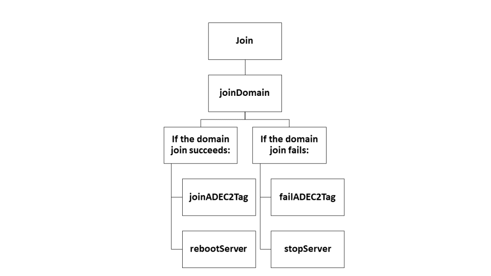
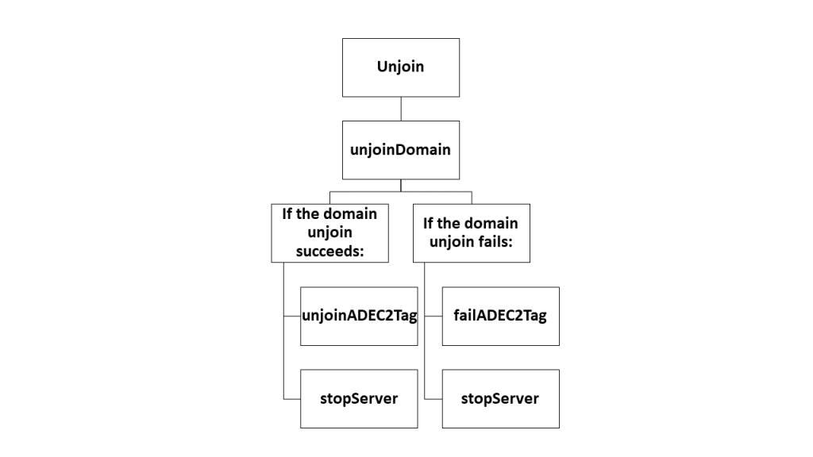
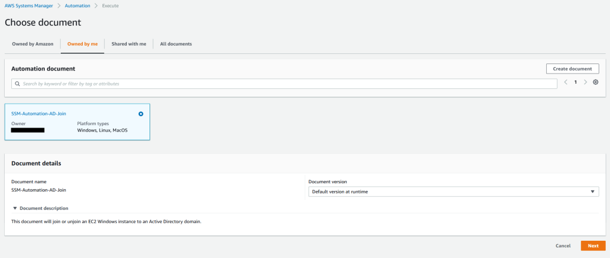
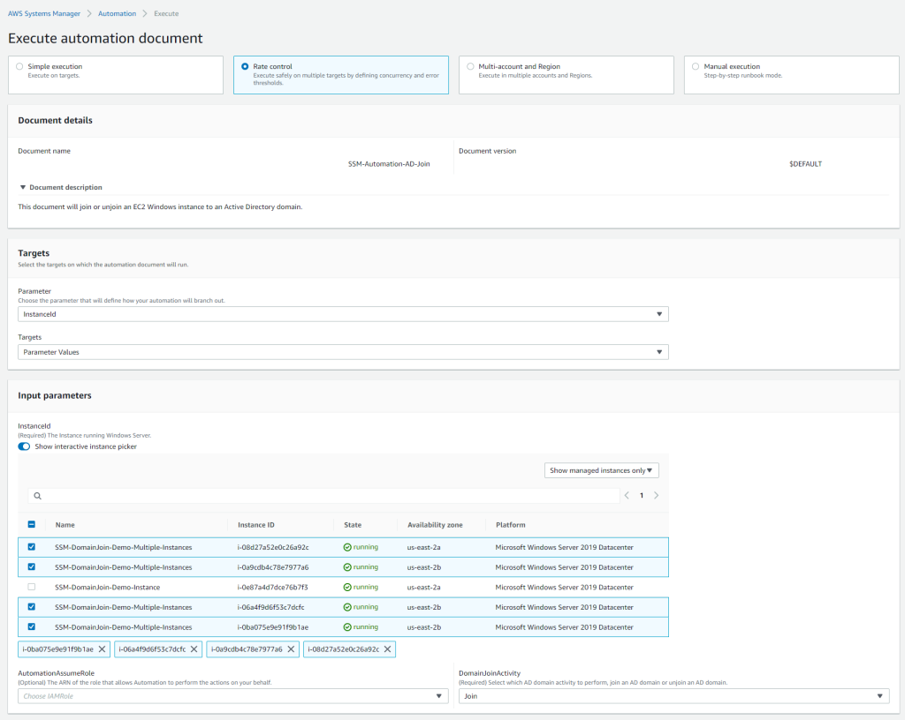
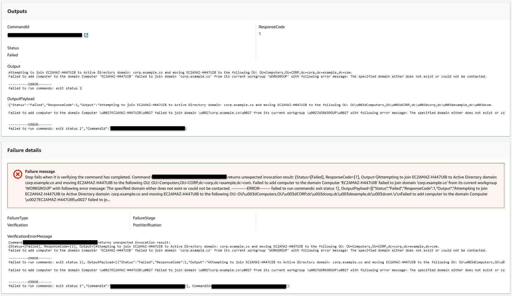
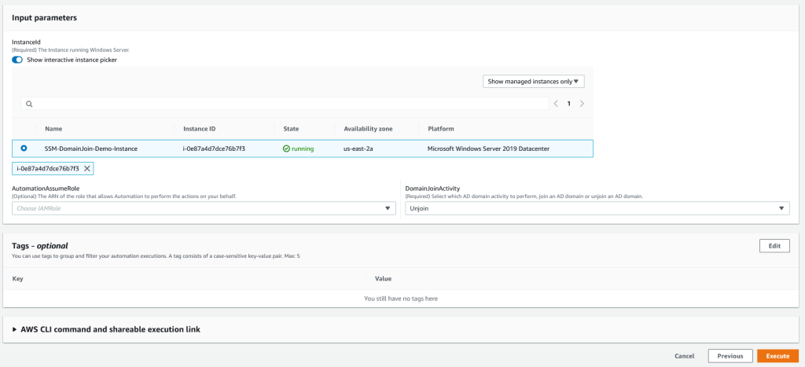

# Active Directory domain join with AWS Systems Manager and AWS Secrets Manager
by Syed Ahmad

## Introduction

Using [AWS Systems Manager Automation](https://docs.aws.amazon.com/systems-manager/latest/userguide/systems-manager-automation.html), you can dynamically automate domain join and unjoin activities with Microsoft Active Directory (AD) for your [Amazon Elastic Compute Cloud](https://docs.aws.amazon.com/ec2) (Amazon EC2) Windows instances. With Automation, you can use [runbooks](https://docs.aws.amazon.com/systems-manager/latest/userguide/automation-documents.html) to perform domain join and unjoin activities manually, automatically, or event-driven. You no longer have to rely on legacy login scripts or third-party software to perform such operations, which cannot be easily scaled in the cloud.

With built-in multiple AWS account and AWS Region support, Systems Manager Automation can ease the domain join and unjoin tasks for your Windows workloads at any size. Automation is flexible as it supports hybrid AD environments, self-managed AD running on Windows Amazon EC2 instances, and [AWS Directory Service for Microsoft Active Directory (AWS Managed Microsoft AD)](https://aws.amazon.com/directoryservice/features/?nc=sn&loc=2). Finally, Systems Manager Automation runbooks can be the glue to other event-driven AWS services. For example, Automation can be used together with Amazon EC2 Auto Scaling to support domain join or unjoin activities for your dynamic fleet of Windows EC2 instances.

## Solution overview

This post will demonstrate how to manually run Automation against a Windows Amazon EC2 instance to join an [AWS Managed Microsoft AD](https://docs.aws.amazon.com/directoryservice/latest/admin-guide/directory_microsoft_ad.html) domain. The steps outlined in this post are also applicable for AD environments in a hybrid cloud or a self-managed AD running on Amazon EC2 instances.

To deploy the runbook and parameters automatically, [download] and save the [AWS CloudFormation template](https://github.com/aws-samples/ssm-automation-custom-ad-domain-join-unjoin/blob/main/templates/cloudformation/cfn-create-ssm-automation-secretmanager-adjoin.yml) from GitHub locally to your computer to create a new CloudFormation stack. Creating a new stack will simplify the deployment of the Automation runbook and create the appropriate parameters to perform the AD join and unjoin activities automatically.

A CloudFormation stack (Figure 1) is created with the name **SSM-Automation-Demo**. The first input parameter in the stack requires you to enter a name for the Automation runbook. For this demo, I will use **SSM-Automation-AD-Join**, though you can enter any name you like as long as it meets the requirements referenced on the stack creation screen. The remaining four input parameters in the stack create the Secrets Manager secret store the AD credentials for the AD domain join and unjoin activities.


Figure 1: Example screenshot of AWS CloudFormation stack creation.

## The Automation runbook workflow

This custom runbook is the central piece of the AD domain join and unjoin workflow. Using this runbook, administrators can manually or automatically trigger domain join or unjoin for their Windows Amazon EC2 instance to or from an AD domain. This post will demonstrate the manual execution of the Automation. The following parameters that need to be specified.

### Parameters

- ***AutomationAssumeRole*** -- This optional service role gives the automation permission to perform actions on your behalf, for example, when configuring automatic domain join and unjoin activities with [Amazon EventBridge](https://docs.aws.amazon.com/eventbridge/latest/userguide/eb-what-is.html) or [AWS Systems Manager State Manager](https://docs.aws.amazon.com/systems-manager/latest/userguide/systems-manager-state.html).
- ***InstanceId*** -- The Windows Amazon EC2 instance ID where your runbook will run the commands. The instance ID is persistent throughout the runbook.
- ***DomainJoinActivity*** -- A dropdown option allowing you to select to either **Join** or **Unjoin** from an AD domain. Depending on which option you choose, the runbook will perform the appropriate follow-up steps.

## Runbook steps

There are 9 steps in the Automation workflow. Here are descriptions of the key steps and how they factor into the AD domain join and unjoin activities.

- ***assertInstanceIsWindows*** -- The first step checks if the Amazon EC2 instance is running Windows and will only continue if the platform is Windows. The aws:assertAwsResourceProperty action allows you to assert a specific resource state or event state for a specific Automation step. Visit aws:assertAwsResourceProperty, to learn more. 
- ***chooseDomainJoinActivity*** -- This step is associated with the aws:branch action, which allows Automation to conditionally follow the steps relevant to join an AD domain or unjoin from an AD domain. It is similar in concept to a basic if-else statement in PowerShell, for example. Visit aws:branch to learn more.

Below are the decision trees that explain the steps in sequence for both successful and failed domain joins (Figure 2) and unjoins (Figure 3).



Figure 2: Decision tree when users select **Join** in chooseDomainJoinActivity.



Figure 3: Decision tree when users select **Unjoin** in chooseDomainJoinActivity.

### Join and unjoin domain

There are two steps, ***joinDomain*** and ***unjoinDomain***, that are associated with the aws:runCommand action. Either of these steps can be run directly on respective Amazon EC2 instances. Since I am working on Windows Server explicitly, I want to run domain join and unjoin related commands using PowerShell with the aid of the **[AWS-RunPowerShellScript](https://docs.aws.amazon.com/systems-manager/latest/userguide/powershell-run-command-linux.html)** command document. Visit aws:runCommand to learn more.

The PowerShell statements in both the ***joinDomain*** and ***unjoinDomain*** steps are wrapped in the try and catch blocks. If either step succeeds, the Amazon EC2 instance will be tagged to indicate the instance has been joined or unjoined to or from the AD domain. Reboots are only applied upon a successful domain join executing the ***rebootServer*** step upon the join activity. Otherwise, the runbook will stop the EC2 instance by running the ***stopServer*** step upon the unjoin activity. If either step fails, a **Failed** status is returned and outputted in the Systems Manager Automation console. The Automation also runs the ***failADEC2Tag*** step**,** which tags the Amazon EC2 instance to reflect the failure and then runs the ***stopServer*** step to stop the Amazon EC2 instance. This allows you to troubleshoot the failure and try again.

The following PowerShell statement implements the ***joinDomain*** step:
```powershell
If ((Get-CimInstance -ClassName 'Win32_ComputerSystem' -ErrorAction SilentlyContinue | Select-Object -ExpandProperty 'PartOfDomain') -eq $false) {
  Try {
        $jsonSecretValue = (Get-SECSecretValue -SecretId ${SecretKeyADPasswordResource}).SecretString | ConvertFrom-Json
        $targetOU = $jsonSecretValue.defaultTargetOU
        $domainName = $jsonSecretValue.domainName
        $domainJoinUserName = $jsonSecretValue.domainJoinUserName
        $domainJoinPassword = $jsonSecretValue.domainJoinPassword | ConvertTo-SecureString -AsPlainText -Force
    } Catch [System.Exception] {
        Write-Output "Failed to get secret $_"
    }
    $domainCredential = New-Object System.Management.Automation.PSCredential($domainJoinUserName, $domainJoinPassword)
 
    Try {
        Write-Output "Attempting to join $env:COMPUTERNAME to Active Directory domain: $domainName and moving $env:COMPUTERNAME to the following OU: $targetOU."
        Add-Computer -ComputerName $env:COMPUTERNAME -DomainName $domainName -Credential $domainCredential -OUPath $targetOU -Restart:$false -ErrorAction Stop 
    } Catch [System.Exception] {
        Write-Output "Failed to add computer to the domain $_"
        Exit 1
    }
} Else {
    Write-Output "$env:COMPUTERNAME is already part of the Active Directory domain $domainName."
    Exit 0
}
```
The following PowerShell statement implements the ***unjoinDomain*** step:
```powershell
If ((Get-CimInstance -ClassName 'Win32_ComputerSystem' -ErrorAction SilentlyContinue | Select-Object -ExpandProperty 'PartOfDomain') -eq $true) {
    Try {
        $jsonSecretValue = (Get-SECSecretValue -SecretId ${SecretKeyADPasswordResource}).SecretString | ConvertFrom-Json 
        $domainName = $jsonSecretValue.domainName
        $domainJoinUserName = $jsonSecretValue.domainJoinUserName
        $domainJoinPassword = $jsonSecretValue.domainJoinPassword | ConvertTo-SecureString -AsPlainText -Force
    } Catch [System.Exception] {
        Write-Output "Failed to get secret $_"
    }

    $domainCredential = New-Object System.Management.Automation.PSCredential($domainJoinUserName, $domainJoinPassword)

    If (-not (Get-WindowsFeature -Name 'RSAT-AD-Tools' -ErrorAction SilentlyContinue | Select-Object -ExpandProperty 'Installed')) {
        Write-Output 'Installing RSAT AD Tools to allow domain joining'
        Try {
            $Null = Add-WindowsFeature -Name 'RSAT-AD-Tools' -ErrorAction Stop
        } Catch [System.Exception] {
            Write-Output "Failed to install RSAT AD Tools $_"
            Exit 1
        }    
    }
    
    $getADComputer = (Get-ADComputer -Identity $env:COMPUTERNAME -Credential $domainCredential)
    $distinguishedName = $getADComputer.DistinguishedName

    Try {
        Remove-Computer -ComputerName $env:COMPUTERNAME -UnjoinDomainCredential $domainCredential -Verbose -Force -Restart:$false -ErrorAction Stop
        Remove-ADComputer -Credential $domainCredential -Identity $distinguishedName -Server $domainName -Confirm:$False -Verbose -ErrorAction Stop
    } Catch [System.Exception] {
        Write-Output "Failed to remove $env:COMPUTERNAME from the $domainName domain and in a Windows Workgroup. $_"
        Exit 1
    }  
} Else {
    Write-Output "$env:COMPUTERNAME is not part of the Active Directory domain $domainName and already part of a Windows Workgroup."
    Exit 0
}
```
**Note:** When automating a large number of AD domain unjoins, for example with an [Auto Scaling group](https://docs.aws.amazon.com/autoscaling/ec2/userguide/auto-scaling-groups.html), you potentially leave a large number of computer objects in the Active Directory deleted object container for up to 360 days. A separate automation can remove these objects using the following PowerShell cmdlet:
```powershell
Get-ADObject -filter {sAMAccountName -eq "$"} -includeDeletedObjects -property * | Remove-ADObject.
```
To learn more, visit [Get-ADObject](https://learn.microsoft.com/en-us/powershell/module/activedirectory/get-adobject?view=windowsserver2022-ps).

### Secret store AD domain configuration

The runbook uses a secret to store the AD credentials in Secrets Manager. Secrets Manager helps you manage and retrieve the AD credentials needed to perform AD join and unjoin activities. The secret is encrypted and decrypted with an AWS KMS [customer managed key](https://docs.aws.amazon.com/kms/latest/developerguide/concepts.html#customer-cmk). The customer managed key is an AWS KMS key that is created, owned and managed by you and can be shared to other AWS accounts and AWS Regions if needed. The secret and customer managed key are referenced in the runbook, specifically in the PowerShell scripts, by using the secret's value and customer managed key ID specified when the secret is created. These values are not hard coded in the PowerShell code, allowing AD admins to rotate the password and securely update the secret without modifying the code.

In particular, this solution uses 4 values:
- Fully qualified domain name (FQDN) of the AD domain.
- AD username.
- AD password.
- Specific [organizational unit (OU)] in AD where the computer account for the domain-joined instance will be created.

Below is an example of the secret stored in JSON within Secrets Manager with the AD credentials, domain name, and OU, all of which are required to complete the domain join and unjoin activities. The CloudFormation template will create the secret automatically after filling in the input parameters **(Figure 1)**.

**Note:** The keys and values are case sensitive. The plaintext value of the **domainJoinUserName** key requires two backslashes to parse the down-level logon name format.
```json
{
    "domainName": "corp.example.com",
    "domainJoinUserName": "CORP\\Admin",
    "domainJoinPassword": "YOURPASSWORD",
    "defaultTargetOU": "OU=Computers,OU=CORP,dc=corp,dc=example,dc=com"
} 
```
### Configure Amazon EC2 permissions

The CloudFormation stack creates an instance profile that passes permissions to an Amazon EC2 instance. You will need to attach this instance profile to Amazon EC2 instances to perform AD join or unjoin. This role gives your Amazon EC2 instances permissions to Systems Manager core functionality by the **AmazonSSMManagedInstanceCore** AWS managed policy, get the secret value stored in Secrets Manager, and decrypt the customer managed key in AWS KMS.

The CloudFormation stack also creates a customer managed policy to access Secrets Manager and AWS KMS.
```json
{
    "Version": "2012-10-17",
    "Statement": [
        {
            "Action": [
                "secretsmanager:GetSecretValue",
                "kms:DescribeKey",
                "kms:Decrypt"
            ],
            "Resource": [
                "arn:aws:secretsmanager:AWSREGION:YOURACCOUNTID:secret:YOURADSECRET",
                "arn:aws:kms:AWSREGION:YOURACCOUNTID:key/YOURKMSKEYID"
            ],
            "Effect": "Allow"
        }
    ]
}
```
### Putting it all together

Now that the key steps in the runbook and the secret needed are recognized, I will walk through an example of how to manually domain join an Amazon EC2 instance.

#### Prerequisites

- An [AWS CloudFormation](https://docs.aws.amazon.com/AWSCloudFormation/latest/UserGuide/Welcome.html) template to deploy the Automation runbook. To create the Automation runbook manually, download the [ssm-automation-domainjoinunjoin.yaml](https://github.com/aws-samples/ssm-automation-custom-ad-domain-join-unjoin/blob/main/templates/systemsmanager/ssm-automation-domainjoinunjoin.yaml) template and author a custom Automation runbook.
- AD join/unjoin relevant credentials stored in [AWS Secrets Manager](https://docs.aws.amazon.com/secretsmanager/latest/userguide/intro.html).
- [Automation actions](https://docs.aws.amazon.com/systems-manager/latest/userguide/automation-actions.html) to run PowerShell.
- An [instance profile](https://docs.aws.amazon.com/IAM/latest/UserGuide/id_roles_use_switch-role-ec2_instance-profiles.html) that passes an AWS Identity and Access Management (IAM) role to an EC2 instance with minimum permissions for Secrets Manager and [AWS Key Management Service](https://docs.aws.amazon.com/kms/latest/developerguide/overview.html) (AWS KMS)

**Note:** This guide assumes your DNS has been configured already for your AD environment running in AWS. Configuring DNS at scale is beyond the scope of this blog. You can review existing guides to configure such an environment with either [Amazon Route 53 Resolver endpoints](https://d1.awsstatic.com/whitepapers/aws-hybrid-dns-with-active-directory.pdf) or [DHCP option sets in Amazon VPC](https://docs.aws.amazon.com/vpc/latest/userguide/VPC_DHCP_Options.html).

1. Open the [AWS Systems Manager console](https://console.aws.amazon.com/systems-manager). 
2. In the navigation pane, choose **Automation** and then choose **Execute automation** (Figure 4).


Figure 4: Execution automation in AWS Systems Manager.

3. In the **Automation document** list, select the **Owned by me** tab to view the custom runbook. Select the **SSM-Automation-AD-Join** runbook.
4. In the **Document details** section, verify that **Document version** is set to **Default version at runtime**. While I will choose the default version in this example, the system includes the following version options:
   - **Default version at runtime**: Choose this option if the Automation runbook is updated periodically and a new default version is assigned.
   - **Latest version at runtime**: Choose this option if the Automation runbook is updated periodically, and you want to run the version that was most recently updated.
   - **1 (Default)**: Choose this option to run the first version of the document, which is the default (Figure 5).



Figure 5: Choose automation runbook.

5. Choose **Next**.
6. In the **Execution Mode** section, choose **Simple execution**.
7. In the **Input parameters** section, specify the required inputs.
   - Select an **Instance ID** from the interactive instance picker.
   - In the **DomainJoinActivity** dropdown, select **Join**.
8. Choose **Execute** (Figure 6).


Figure 6: Select your instance and DomainJoinActivity. This example demonstrates the Join activity.

**Note:** Simple execution targets a single Amazon EC2 instance. To deploy this runbook against multiple Amazon EC2 instances, you can choose **Rate control** in the **Execution Mode** section. In this mode, you can define your targets based on different parameters. For example, you can select ***InstanceId*** as the **Parameter** and ***Parameter Values*** as the **Targets**. From there, you can multi-select all of the Amazon EC2 instances you want to join to AD. Refer to Figure 7 to see what this looks like and our [Run automations at scale](https://docs.aws.amazon.com/systems-manager/latest/userguide/automation-working-targets-and-rate-controls.html) for more details on how to deploy runbooks for multiple targets.



Figure 7: Selecting multiple instances and to configure DomainJoinActivity to perform the Join activity.

9. The **Execution detail** screen will show a green banner stating **Execution has been initiated**. From here, each individual step is run in the **Executed steps**.
   - The overall status is available in the **Executions status**.
   - Each step can be viewed by clicking on the **Step ID** link along with start and end time stamps.
   - The **Step ID** is unique to every execution.
10. Each step indicates individual **Success** or **Failed** in the **Status** column (Figure 8).


Figure 8: Execution detail screen showing **Success** and the executed steps.

11. For example, to see the details of Step #3, I can select the Step ID.
12. Since this step runs PowerShell locally on the Windows Amazon EC2 instance, the **Outputs** displays PowerShell output relevant to the **[Add-Computer](https://docs.microsoft.com/en-us/powershell/module/microsoft.powershell.management/add-computer?view=powershell-5.1)** cmdlet.
13. To go back to the **Execution detail** screen, select **Back to execution detail** (Figure 9).


Figure 9: An example of a successful step details and outputs.

14. After all the execution steps have successfully completed, the Windows Amazon EC2 instance has been joined to AD.

The process to join a Windows Amazon EC2 instance to AD is easy using Automation. With Automation, you can review the steps as they are processed or follow-up from within the Systems Manager console at any time. If a failure occurs on any step, the entire process will stop, and the failed process can be reviewed by selecting the **Step ID**.

Below are example screenshots of a failed domain join attempt due to an improper parameter configuration. Step 3 failed and is clearly indicated with a status of **Failed** (Figure 10). The specific output of the failure is a specific PowerShell error related to the **Add-Computer** cmdlet (Figure 11).


Figure 10: Execution detail screen with a failure in Step 3.



Figure 11: An example of a failed step details and outputs.

Finally, to remove the Amazon EC2 instance from AD, simply rerun the Automation runbook and select **Unjoin** in the **DomainJoinActivity** dropdown (Figure 12). Similar to the domain join process, the unjoin process will run the **[Remove-Computer](https://docs.microsoft.com/en-us/powershell/module/microsoft.powershell.management/remove-computer?view=powershell-5.1)** and **[Remove-ADComputer](https://docs.microsoft.com/en-us/powershell/module/activedirectory/remove-adcomputer?view=windowsserver2019-ps)** cmdlets to remove the instance from AD and clean up AD immediately.



Figure 12: An example runbook execution where the DomainJoinActivity is configured for the **Unjoin** activity.