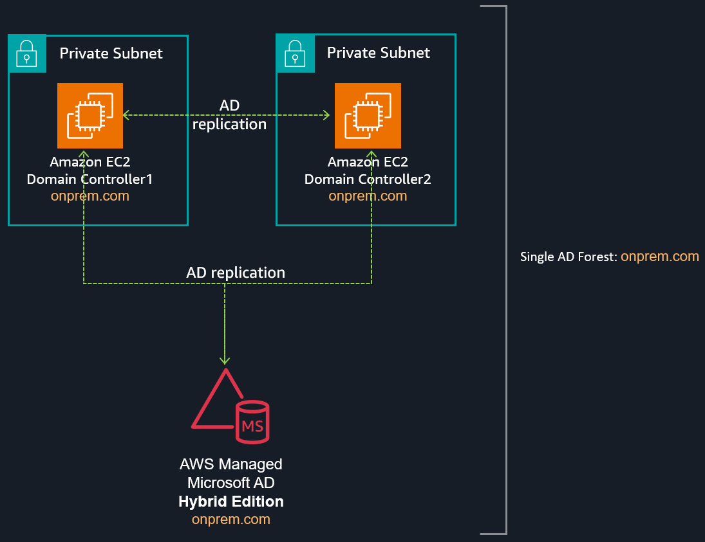

# Automate deployment of your AWS Managed Microsoft AD Hybrid Edition
by Tekena Orugbani

## Introduction
You can deploy the [Hybrid Edition](https://docs.aws.amazon.com/directoryservice/latest/admin-guide/aws-hybrid-directory.html) of [AWS Directory Service](https://aws.amazon.com/directoryservice/) for Microsoft Active Directory (AWS Managed Microsoft AD) using the AWS Cloudformation template provided in the post. Hybrid Edition lets you extend your existing self-managed Active Directory (AD) domain to AWS Managed Microsoft AD while preserving your current identity and access infrastructure. AWS Managed Microsoft AD (Hybrid Edition) facilitates the migration of your Active Directory–dependent workloads to AWS and natively integrates with AWS applications and services. This capability enables the integration of your existing Active Directory with AWS’ fully managed infrastructure, offering additional monitoring capabilities for your Active Directory.

Read the official blog post for more details:
https://aws.amazon.com/blogs/modernizing-with-aws/extend-your-active-directory-domain-to-aws-with-aws-managed-microsoft-ad-hybrid-edition/

## Solution overview
The AWS CloudFormation template deploys the following:

- A new VPC with associated network resources like subnets, route tables, etc.
- A new self-managed AD forest (onprem.com) with two domain controllers in differents availability zones.
- Extends the self managed-AD domain to Hybrid Edition
- Generates and stores the domain administrator credentials in [AWS Secrets Manager](https://console.aws.amazon.com/secretsmanager)
- A security group allowing inbound traffic only from the VPC CIDR.

Here is an architecture of what you get when you deploy the template.


Figure 1 - Deployment architecture 


Download the template from [this link.](https://github.com/aws-samples/technical-notes-for-microsoft-workloads-on-aws/blob/9831d577fd1df7f510c98656edc5cf3645c56641/docusaurus/docs/Active%20Directory/Guides/Automate%20deployment%20of%20your%20AWS%20Managed%20Microsoft%20AD%20Hybrid%20Edition/Scripts/buildbybrid.yml%E2%80%8E)

## Review your deployment
After deployment, [modify the security group](https://console.aws.amazon.com/ec2/home#SecurityGroups:) to allow RDP access from your source IP address to the self-managed DCs on EC2. You can also retrieve the Active Directory credentials from AWS Secrets Manager. This allows you to review the domain structure using the Active Directory management tools. You should find four domain controllers: two self-managed and two AWS managed DCs.

You can verify this by running the following command in PowerShell:

``` PowerShell
Get-ADDomainController -Filter * | select hostname, ipv4Address
```
