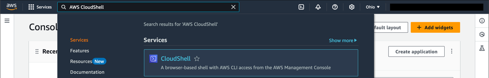
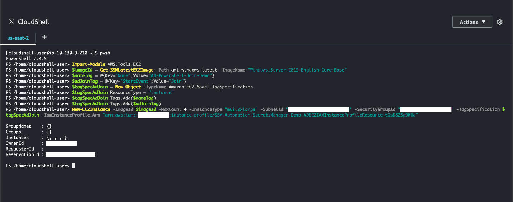
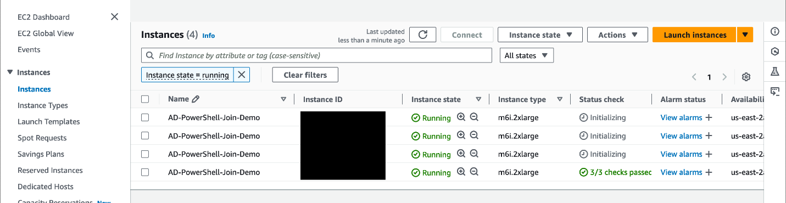
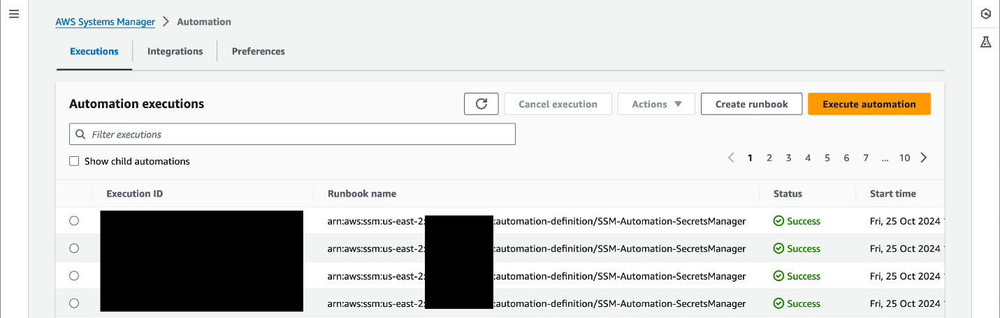
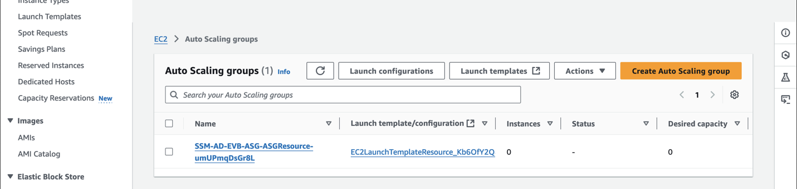
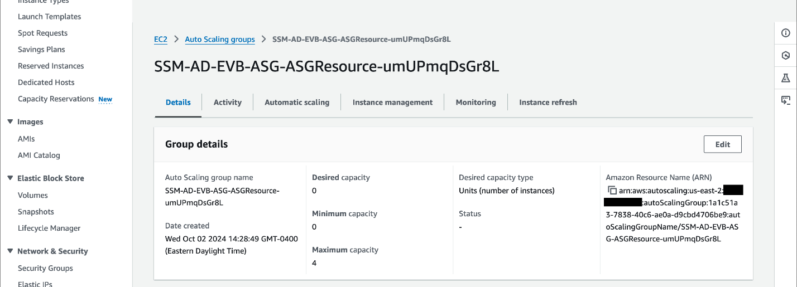
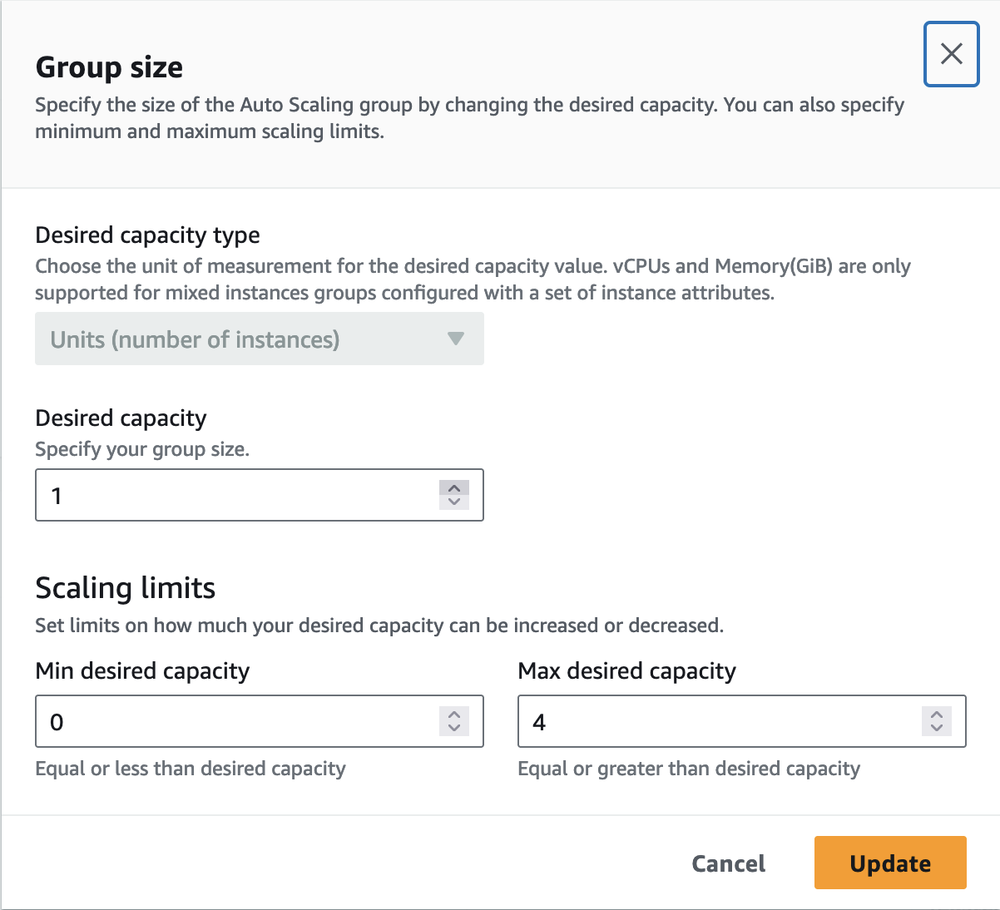
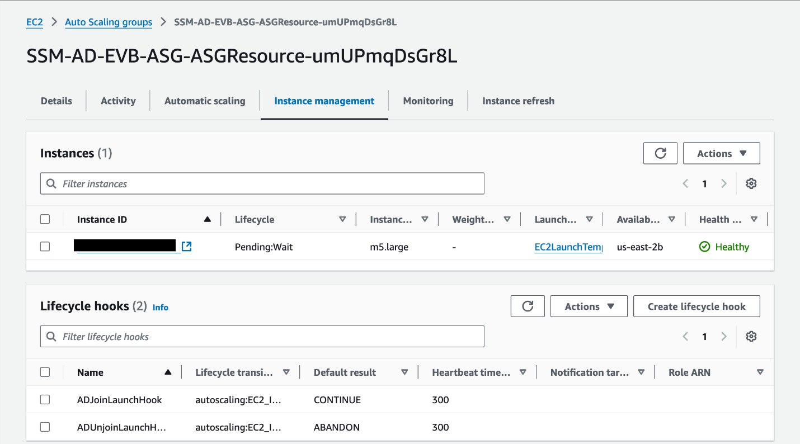
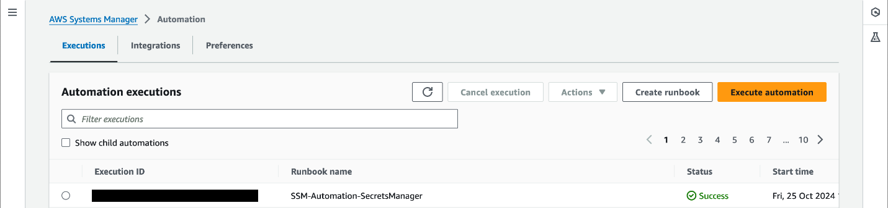
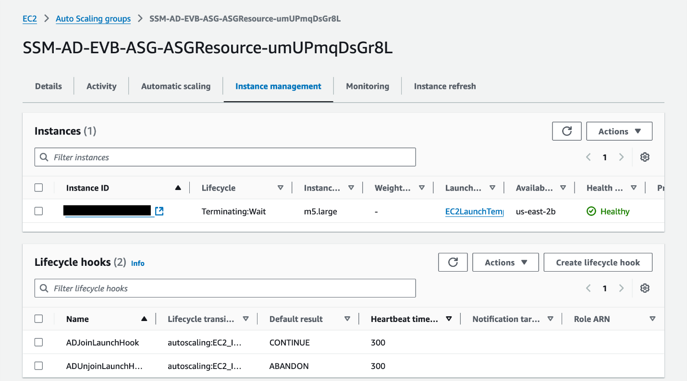

# Event-driven Active Directory domain join with Amazon EventBridge
by Syed Ahmad

## Introduction

In this post, I will show you how [Amazon EventBridge](https://docs.aws.amazon.com/eventbridge/latest/userguide/eb-what-is.html) can automate Microsoft Active Directory (AD) domain join and unjoin for your [Amazon Elastic Compute Cloud (Amazon EC2)](https://docs.aws.amazon.com/AWSEC2/latest/UserGuide/concepts.html) instances. In a previous [post](https://aws-samples.github.io/technical-notes-for-microsoft-workloads-on-aws/Active%20Directory/Guides/Active_Directory_domain_join_with_AWS_Systems_Manager_and_AWS_Secrets_Manager/), I showed you how [AWS Systems Manager Automation](https://docs.aws.amazon.com/systems-manager/latest/userguide/systems-manager-automation.html) can dynamically domain join and unjoin EC2 instances manually. I will show you two examples of AD domain join and unjoin automation that are event driven, Amazon EC2 tag triggering [AWS Lambda](https://docs.aws.amazon.com/lambda/latest/dg/welcome.html) and [Amazon EC2 Auto Scaling](https://docs.aws.amazon.com/autoscaling/ec2/userguide/what-is-amazon-ec2-auto-scaling.html).

## Solution Overview

EventBridge is a serverless service that lets you connect applications using events. It listens for specific events in your AWS environment based on rules and subsequently triggers actions in response (Figure 1). This post presents two solutions for domain join and unjoin using EventBridge. The first solution allows you to domain join or unjoin with Amazon EC2 tags. The second solution allows you to domain join or unjoin with Amazon EC2 Auto Scaling.


Figure 1 - Example Amazon EventBridge workflow which routes events to an AWS Lambda function and then AWS Systems Manager Automation.

## Prerequisites

Both solutions are available as [AWS CloudFormation](https://docs.aws.amazon.com/AWSCloudFormation/latest/UserGuide/Welcome.html) templates. To start, deploy the [Automation runbook](https://github.com/aws-samples/ssm-automation-custom-ad-domain-join-unjoin/blob/main/templates/cloudformation/cfn-create-ssm-automation-secretmanager-adjoin.yml) from the previous post.

**Note:** This guide assumes DNS has been configured already for your AD environment running in AWS. Configuring DNS at scale is beyond the scope of this blog. You can review existing guides to configure such an environment with either [Amazon Route 53 Resolver endpoints](https://d1.awsstatic.com/whitepapers/aws-hybrid-dns-with-active-directory.pdf) or [DHCP option sets in Amazon
VPC](https://docs.aws.amazon.com/vpc/latest/userguide/VPC_DHCP_Options.html).

The components of the [EC2 tag solution](https://github.com/aws-samples/ssm-automation-custom-ad-domain-join-unjoin/blob/main/templates/cloudformation/cfn-evb-lambda-tags-adjoinunjoin.yaml) include:

- A Python-based [Lambda function](https://github.com/aws-samples/ssm-automation-custom-ad-domain-join-unjoin/blob/main/templates/lambda/ec2-tags-domainjoinunjoin.py). 
- An EventBridge rule that triggers the Lambda function. 
- [Identity and Access Management (IAM) roles](https://docs.aws.amazon.com/systems-manager/latest/userguide/setup-instance-profile.html)
  to provide permissions to the Lambda function. 
- [Amazon CloudWatch Logs](https://docs.aws.amazon.com/AmazonCloudWatch/latest/logs/WhatIsCloudWatchLogs.html) that logs Lambda function output.

- To create the Lambda function manually, [download]{.underline} the [Python function from GitHub](https://github.com/aws-samples/ssm-automation-custom-ad-domain-join-unjoin/blob/main/templates/lambda/ec2-tags-domainjoinunjoin.py).

The components of the [Amazon EC2 Auto Scaling solution](https://github.com/aws-samples/ssm-automation-custom-ad-domain-join-unjoin/blob/main/templates/cloudformation/cfn-evb-ssm-automation-adjoinunjoin.yaml) include:

- An Auto Scaling group. 
- Two lifecycle hooks. 
  - One lifecycle hook for instance launching. 
  - One lifecycle hook for instance termination. 
- An [Amazon EC2 launch template](https://docs.aws.amazon.com/autoscaling/ec2/userguide/launch-templates.html) associated with the Auto Scaling group. 
- [Amazon Simple Notification Service topic](https://docs.aws.amazon.com/sns/latest/dg/sns-create-topic.html). 
- Two EventBridge rules. 
  - One rule to join Amazon EC2 instances to your AD domain. 
  - One rule to unjoin Amazon EC2 instances from your AD domain. 
- IAM roles and policies.

## Walkthroughs

I will start with the Amazon EC2 tag walkthrough. Tagging your Amazon EC2 instances with **StartEvent** will activate the EventBridge rule, triggering your Lambda function to execute the Automation runbook. The [Lambda function](https://github.com/aws-samples/ssm-automation-custom-ad-domain-join-unjoin/blob/main/templates/lambda/ec2-tags-domainjoinunjoin.py) evaluates the domain activity based on the Amazon EC2 tag value, either **Join** or **Unjoin**. In addition, the Lambda function will start Amazon EC2 instances if they are not in a running state before executing the Automation runbook.

**Note:** Additional tag compliances can be configured in your AWS account with services such as [AWS Config](https://docs.aws.amazon.com/config/latest/developerguide/WhatIsConfig.html).

### Amazon EC2 tag walkthrough

New or existing Amazon EC2 tags are matched with the **Tag Change on Resource** event.
```json
{
  "detail-type": ["Tag Change on Resource"],
  "source": ["aws.tag"],
  "detail": {
    "changed-tag-keys": ["StartEvent"],
    "service": ["ec2"],
    "resource-type": ["instance"]
  }
}
```
Now I will walk through [AWS Tools for PowerShell](https://aws.amazon.com/powershell/) examples to join multiple Amazon EC2 instances from an AD domain using EC2 tags.

1. Open the console, search for **AWS CloudShell**, and select **CloudShell** (Figure 2).



Figure 2 - Opening CloudShell from the AWS Management Console.

2. At the **CloudShell** prompt, type **pwsh**, and press **Enter**.
3. At the PowerShell prompt, paste and run the following PowerShell statement to launch Windows Amazon EC2 instances.
   - Replace **SubnetId**, **SecurityGroupId**, and **IamInstanceProfile_Arn** parameters with values within your AWS account.
   - This walkthrough launches 4 Amazon EC2 instances of m6i.2xlarge instance type.
```powershell
Import-Module AWS.Tools.EC2
$imageId = Get-SSMLatestEC2Image -Path ami-windows-latest -ImageName "Windows_Server-2019-English-Core-Base"
$nameTag = @{Key="Name";Value="AD-PowerShell-Join-Demo"}
$adJoinTag = @{Key="StartEvent";Value="Join"}
$tagSpecAdJoin = New-Object -TypeName Amazon.EC2.Model.TagSpecification
$tagSpecAdJoin.ResourceType = "instance"
$tagSpecAdJoin.Tags.Add($nameTag)
$tagSpecAdJoin.Tags.Add($adJoinTag)
New-EC2Instance -ImageId $imageId -MaxCount 4 -InstanceType "YOURINSTANCETYPE" -SubnetId "YOURSUBNETID" -SecurityGroupId "YOURSECURITYGROUPID" -TagSpecification $tagSpecAdJoin -IamInstanceProfile_Arn "YOURINSTANCEPROFILEARN"
```
4. If successful, a **ReservationID** will be displayed in CloudShell (Figure 3).



Figure 3 - Running **New-EC2Instance** cmdlet in AWS CloudShell.

5. Confirm the EC2 instances are launching in the [Amazon EC2 console](https://console.aws.amazon.com/ec2/) (Figure 4).
6. In the navigation pane, choose **Instances**, and the running Amazon EC2 instances will be listed in the console.
7. After all status checks have passed, navigate to the [Systems Manager console](https://console.aws.amazon.com/systems-manager/).



Figure 4 - Four new EC2 instances launched from AWS CloudShell.

8. In the navigation pane, select **Automation**. If successful, 4 executions will be listed (Figure 5).

{width="6.5in" height="2.071847112860892in"}

Figure 5 - Four Automation runbook executions with a status code of **Success** which means the AD domain join was completed.

Now I will show you how easy it is to remove these Amazon EC2 instances from the same AD domain using PowerShell.

9. Follow Step 1 to launch **CloudShell** if it was closed.
10. At the PowerShell prompt, paste and run the following PowerShell statement, making note of the Amazon EC2 tag's value changing to **Unjoin**.
```powershell
Import-Module AWS.Tools.EC2
$adUnjoinTag = New-Object -TypeName Amazon.EC2.Model.Tag
$adUnjoinTag.Key = "StartEvent"
$adUnjoinTag.Value = "Unjoin"
$instanceIds = (Get-EC2Instance -Filter @{Name="tag:Name";Values="AD-PowerShell-Join-Demo"}).Instances.InstanceId

foreach ($instanceid in $instanceIds) {
    New-EC2Tag -Resource $instanceid -Tag $adUnjoinTag
}

```
11. If successful, validate the tags are changed in the Amazon EC2 console (Figure 6).

{width="6.5in" height="3.0136865704286966in"}

Figure 6 - Tag value changed to **Unjoin** after running the PowerShell script.

12. Navigate to the [Systems Manager console](https://console.aws.amazon.com/systems-manager/).
13. In the navigation pane, select **Automation**. A new set of executions will have started, attempting to remove the Amazon EC2 instances from the AD domain.

### Amazon EC2 Auto Scaling walkthrough

New Amazon EC2 instances that are launched by an Auto Scaling group are matched with the **EC2 Instance-launch Lifecycle Action** event.
```json
{
  "detail-type": ["EC2 Instance-launch Lifecycle Action"],
  "source": ["aws.autoscaling"],
  "detail": {
    "AutoScalingGroupName": ["YOURASGNAME"]
  }
}
```
Terminating Amazon EC2 instances from an Auto Scaling group is matched with the **EC2 Instance-terminate Lifecycle Action** event. The event pattern differs slightly with the **detail-type** of the EC2 Instance-terminate Lifecycle Action.

Another scalable method to perform AD domain join or unjoin is with Amazon EC2 Auto Scaling. Windows workloads that are AD-aware scale with an Auto Scaling group and ensure that each Amazon EC2 instance are added to an AD domain at launch or removed from the same AD domain before termination. EventBridge rules monitor Auto Scale group events through their lifecycle policies.

Now I will walk through an example of scaling up and down with an AD domain.

14. Navigate to the [Amazon EC2 console](https://console.aws.amazon.com/ec2/).
15. In the navigation pane, choose **Auto Scaling Groups**, and then select the Auto Scaling group created by the CloudFormation template (Figure 7).



Figure 7 - Auto Scaling group created by the CloudFormation template.

16. In **Details** tab, select **Edit** in the **Group Details** panel (Figure 8).



Figure 8 - The Details tab showing the Auto Scaling group details.

17. Change the **Desired capacity type** from **0** to **1** and select **Update**. This will add one new Amazon EC2 instance to the Auto Scaling group (Figure 9).



Figure 9 - Manually changing the **Desired Capacity** from 0 to 1, manually adding a new Amazon EC2 instance to the Auto Scaling group.

18. In the **Instance management** tab, the Lifecycle of the Amazon EC2 instance will change from **Pending:Wait** to **InService** (Figure 10).



Figure 10 - New Amazon EC2 instance in **Pending:Wait** lifecycle, which will trigger the EventBridge rule to call Systems Manager Automation.

19. Navigate to the [Systems Manager console](https://console.aws.amazon.com/systems-manager/).
20. In the navigation pane, select **Automation**.

Just like the Amazon EC2 tag example, Systems Manager will execute the AD domain Automation runbook to show that the Auto Scaling launched Amazon EC2 instance has joined the AD domain (Figure 11).

**Note:** If the AD domain join fails, Amazon EC2 instances are stopped and tagged appropriately. If the failure is not remediated, continual scaling activities will occur within an Auto Scaling group. Test your AD join and unjoin with a smaller set of Amazon EC2 instances.



Figure 11 - The Automation runbook execution with a status code of **Success** which means the AD domain join was completed.

Repeating steps 14 -- 18 and changing **Desired capacity type** to **0** will start the removal of Amazon EC2 instances launched by the Auto Scaling group. The event pattern will see the termination lifecycle hook and attempt to remove the Amazon EC2 instance from your AD domain. To confirm, go to the **Instance management** tab and confirm that the Lifecycle changes from **InService** to **Terminating:Wait** (Figure 12**)**.



Figure 12 - Example of an Amazon EC2 instance in a **Terminating:Wait** lifecycle. EventBridge will initiate the Systems Manager Automation runbook to perform an AD domain unjoin activity.
