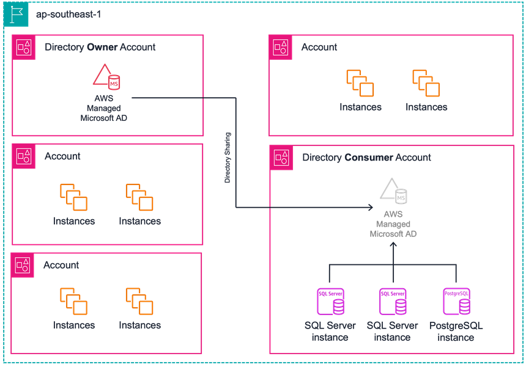

# Optimizing Directory Sharing in AWS Managed Microsoft AD
by Ben Groeneveld

## Introduction

For many organisations using AWS services, enabling Windows / Kerberos authentication is a critical aspect of ensuring secure and efficient management. This process necessitates the use of AWS Directory Service for Microsoft Active Directory (AWS Managed Microsoft AD), a pivotal component for authentication purposes. Especially in environments where multiple AWS accounts are in play, organisations commonly leverage the [Directory Sharing](https://docs.aws.amazon.com/directoryservice/latest/admin-guide/ms_ad_directory_sharing.html) feature within AWS Managed Microsoft AD. This approach facilitates the extension of directory capabilities across numerous accounts, enhancing operational scalability and efficiency.

However, this scalability comes with its own set of challenges, especially for large organisations managing hundreds or even thousands of accounts. The cost implications of Directory Sharing, which are incurred on a per-hour and per-account basis, can be significantly high at such scales, prompting organisations to seek cost-optimisation strategies.

## Our Scenario
The following scenario illustrates a Financial Services Industry (FSI) customer located in Singapore. This customer exclusively operates within the Singapore region and has no plans for regional expansion. Their AWS footprint encompasses 500 accounts, each requiring the deployment of Amazon Relational Database Service (Amazon RDS) database instances. These instances include a mix of Amazon RDS for PostgreSQL and Microsoft SQL Server. Importantly, their cybersecurity team mandates the use of Active Directory authentication for all services, aligning with stringent security protocols.

>Amazon RDS for SQL Server supports integration with a self-managed Active Directory, but this capability is limited exclusively to NTLM authentication.

## Choosing the right AWS Managed Microsoft AD edition

The customer realised that to enable Windows / Kerberos authentication for Amazon RDS, deploying AWS Managed Microsoft AD is a prerequisite. AWS Managed Microsoft AD offers two editions: Standard and Enterprise. The selection between these editions is crucial, particularly in scenarios involving directory sharing across a large number of accounts, as it significantly influences the overall cost. Therefore, making an informed choice of the appropriate edition is essential for cost-effective and efficient directory management.

When selecting the most appropriate AWS Managed Microsoft AD edition, two crucial factors come into play: the number of objects that need to be stored in the directory, and the requirement for extending the directory across multiple regions. In this case, the customer opted for the Standard Edition of AWS Managed Microsoft AD. This decision was based on their specific usage criteria — the directory will be dedicated solely to their Amazon RDS database instances, and the anticipated number of objects will not exceed the 30,000-object limit supported by the Standard Edition. Additionally, since the customer has no plans for geographical expansion beyond the current region, the need for multi-region replication support, a feature not included in the Standard Edition, is irrelevant to their needs.

The below shows the potential cost implications of not choosing the appropriate AWS Managed Microsoft AD edition in the AWS Singapore region:

|   | Standard Edition | Enterprise Edition |
| ------------- |:-------------:| :-------------:|
| Number of accounts | 500  | 500 |
| Hourly Price (per additional account to which the directory is shared)| $0.0213|$0.0744|
| Monthly price|$7,668 | $26,784|
| Annual price|$92,016| $321,408|

It is also important to note the below [AWS Managed Microsoft AD quotas](https://docs.aws.amazon.com/directoryservice/latest/admin-guide/ms_ad_limits.html) for Shared domains per Microsoft AD. The shared domain default quota refers to the number of accounts that an individual directory can be shared to.

| Resource	  | Default quota |
| ------------- |:-------------:|
| Shared domains per Standard Microsoft AD      | 5     |
|Shared domains per Enterprise Microsoft AD     | 125     |

> If necessary, the above mentioned quotas can be raised by submitting a request through a support case.

## Avoid indiscriminate deployment
In certain customer environments, we have observed a tendency for indiscriminate deployment of directory sharing across all accounts. Often, this occurs due to a lack of awareness about the associated costs or in anticipation of future needs. However, such practices can lead to substantial unnecessary expenditure. It is advisable to adopt a more judicious approach to directory sharing, implementing it only when necessary. This strategy aids in minimising both costs and resource wastage.

The list below details AWS applications and services that are compatible with a shared directory, and can be activated within an AWS account:"

| Applications | 
| ------------- |
| Amazon Aurora MySQL     |
| Amazon Aurora PostgreSQL      |
| Amazon FSx     | 
| Amazon RDS for MariaDB     |
| Amazon RDS for MySQL      |
| Amazon RDS for Oracle    | 
|Amazon RDS for PostgreSQL     |
| Amazon RDS for SQL Server      |

## Consolidate where possible
An effective strategy for cost optimisation in AWS Managed Microsoft AD involves consolidating workloads that require directory sharing. By centralising these workloads into fewer AWS accounts, organisations can significantly reduce the number of necessary directory shares. For instance, instead of spreading Amazon RDS database instances across multiple accounts, consolidating them into a single 'database account' can be more cost-efficient. This approach not only decreases the number of directory shares required but also simplifies management and oversight. It's important to assess the feasibility of such consolidation, considering factors like security, compliance, and performance requirements. By strategically grouping workloads that utilise the directory share, organisations can achieve a more streamlined, cost-effective AWS environment. This method directly addresses the challenge of managing multiple directory shares and their associated costs, offering a practical solution for organisations looking to optimize their AWS resource utilisation.

The below image illustrates the customer's environment, where Amazon RDS database instances are deployed across every account. This setup requires a directory share in each account to facilitate Windows / Kerberos authentication. Consequently, each directory share incurs charges for every hour of operation.

To decrease their operational costs, the customer consolidated their Amazon RDS workload into a single database account, thereby necessitating only one directory share.

## Reduce the directory share operational hours
Customers exploring cost optimisation strategies for AWS Managed Microsoft AD often enquire about reducing the operational hours of their directory, rather than completely terminating the share. This approach can be particularly beneficial for services like Amazon EC2, where the flexibility of seamless domain-join allows for more dynamic management of directory usage. However, it's crucial to note that this method is not applicable to certain AWS managed services. For these services, the directory must be operational continuously to ensure uninterrupted service and functionality.

| Application | 
| ------------- |
| Amazon Aurora MySQL     |
| Amazon Aurora PostgreSQL      |
| Amazon FSx     | 
| Amazon RDS for MariaDB     |
| Amazon RDS for MySQL      |
| Amazon RDS for Oracle    | 
|Amazon RDS for PostgreSQL     |
| Amazon RDS for SQL Server      |

The removal of a directory share could lead to certain challenges. These challenges encompass tasks performed by both AWS and the customer. Such tasks might include major version upgrades or addressing break-fix scenarios where an instance may need to be rebuilt or restored from a backup. In unplanned situations, if the directory is unavailable, it could potentially lead to service disruptions. This underscores the importance of careful planning and consideration when managing directory availability to ensure uninterrupted service.

The below image demonstrates that during a major version upgrade, the underlying EC2 instance is replaced. This replacement process involves provisioning a new instance that must join the domain. If the shared directory is unavailable at this crucial time, the upgrade process will inevitably fail.

In the directory consumer account, you can view the shared directory's list of enabled AWS applications and services. As long as there is at least one active instance of a service, it will be marked as enabled in this list.

Any enabled services will prevent the shared directory from being removed in the directory consumer account.

## Leverage self-managed join procedure with Amazon FSx
Customers utilising Amazon FSx, including Amazon FSx for Windows File Server and Amazon FSx for NetApp ONTAP, often integrate these services with AWS Managed Microsoft AD across multiple accounts through directory sharing. This integration is crucial for enabling new directory-joined file systems to join the Active Directory domain. However, in large organisations with extensive AWS account structures, the costs associated with directory sharing for just provisioning Amazon FSx file systems can accumulate quickly.

To mitigate these expenses while continuing to use AWS Managed Microsoft AD, customers can adopt the self-managed AD join process targeted at an AWS managed Microsoft AD. This approach eliminates the need to share the directory with each consumer or workload account, leading to potential significant cost savings. For successful implementation, it’s essential for customers to create a dedicated service account and delegate the necessary permissions within their Organisational Unit in AWS Managed Microsoft AD.

The below image shows an AWS Managed Microsoft AD:

A new Amazon FSx for Windows File Server file system was created and joined to the above directory using the self-managed join procedure:

