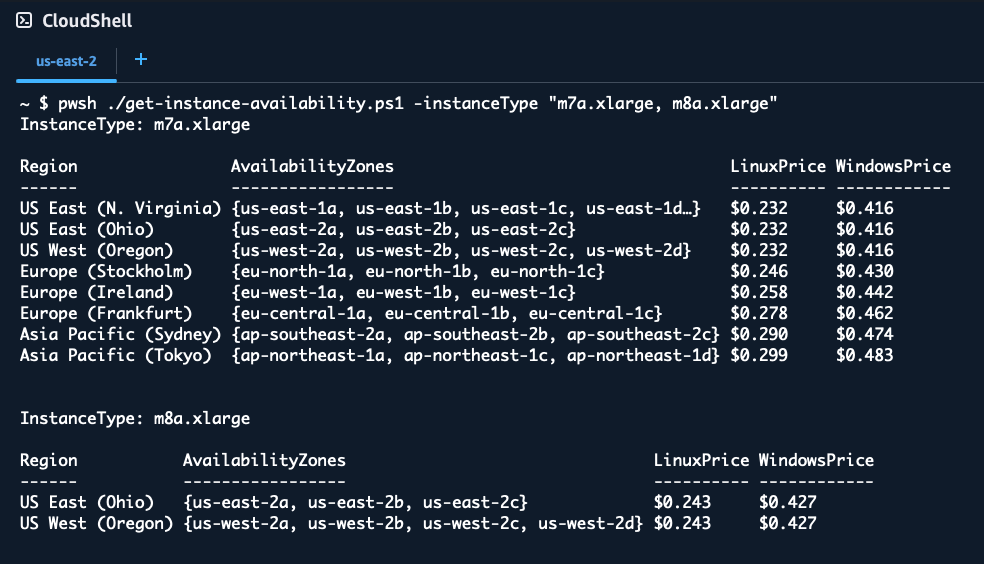

# EC2 Pricing and Availability 

Get EC2 instance type availability and pricing across all enabled AWS regions.

Queries all enabled AWS Regions to find where the specified EC2 instance types are available,
including availability zones and on-demand pricing for Linux and Windows operating systems.  

Use the `-ZoneID` switch to show AZ IDs (e.g., use2-az1) instead of AZ names (e.g., us-east-2a)
 
[The PowerShell script](https://github.com/aws-samples/technical-notes-for-microsoft-workloads-on-aws/blob/main/docusaurus/docs/Code%20Repo/Guides/EC2_Pricing_and_Availability/Scripts/get-instance-availability.ps1) retrieves real-time pricing data from the AWS Pricing API and displays results
in a formatted table showing regional availability and hourly costs.


```bash
.PARAMETER InstanceType
    One or more EC2 instance types to query. Accepts comma-separated values.
    Default: m8a.xlarge

.PARAMETER SortBy
    Sort results by Region, LinuxPrice, or WindowsPrice.
    Default: WindowsPrice

.PARAMETER ZoneId
    Display AZ IDs (e.g., use2-az1) instead of AZ names (e.g., us-east-2a).

.EXAMPLE
    pwsh -File get-instance-availability.ps1
    Run with default parameters (m8a.xlarge, sorted by WindowsPrice).

.EXAMPLE
    pwsh -File get-instance-availability.ps1 -InstanceType m8a.2xlarge
    Query availability and pricing for m8a.2xlarge instances across all regions.

.EXAMPLE
    pwsh -File get-instance-availability.ps1 -InstanceType "m7i.2xlarge,m8i.2xlarge" -SortBy WindowsPrice
    Query multiple instance types and sort results by Windows pricing.

.EXAMPLE
    pwsh -File get-instance-availability.ps1 -InstanceType m8a.xlarge -SortBy Region
    Query m8a.xlarge instances and sort results alphabetically by region name.

.EXAMPLE
    pwsh -File get-instance-availability.ps1 -ZoneId
    Display results with AZ IDs (use2-az1) instead of AZ names (us-east-2a).

.NOTES
    Author: coolcrai@amazon.com
    Version: 1.0
    Last Updated: October 23, 2025
    
    RECOMMENDED: Run this script from AWS CloudShell for the best experience.
    CloudShell comes with PowerShell and AWS modules pre-installed, and credentials
    are automatically configured. Simply upload the script and run it.
    
    Requirements:
    - AWS PowerShell modules: AWS.Tools.EC2, AWS.Tools.Pricing
    - Valid AWS credentials configured
    - Pricing API access (queries us-east-1 region)
    
    Pricing Information:
    - Linux pricing is for standard Linux/Unix instances
    - Windows pricing includes license costs (License Included model)
    - All prices are hourly on-demand rates in USD

```

Example output from [CloudShell](https://docs.aws.amazon.com/cloudshell/latest/userguide/welcome.html)

`$ pwsh ./get-instance-availability.ps1 -instanceType "m7a.xlarge, m8a.xlarge"`


`$ pwsh -File get-instance-availability.ps1 -InstanceType p5.4xlarge`
