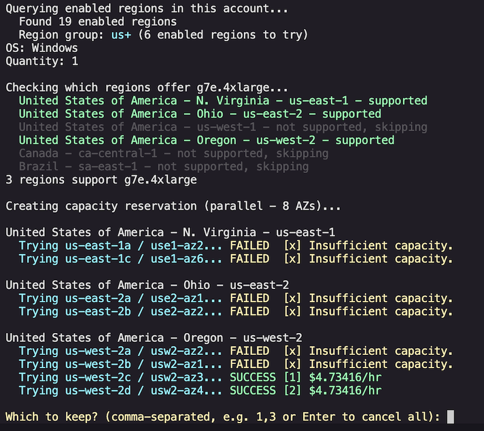
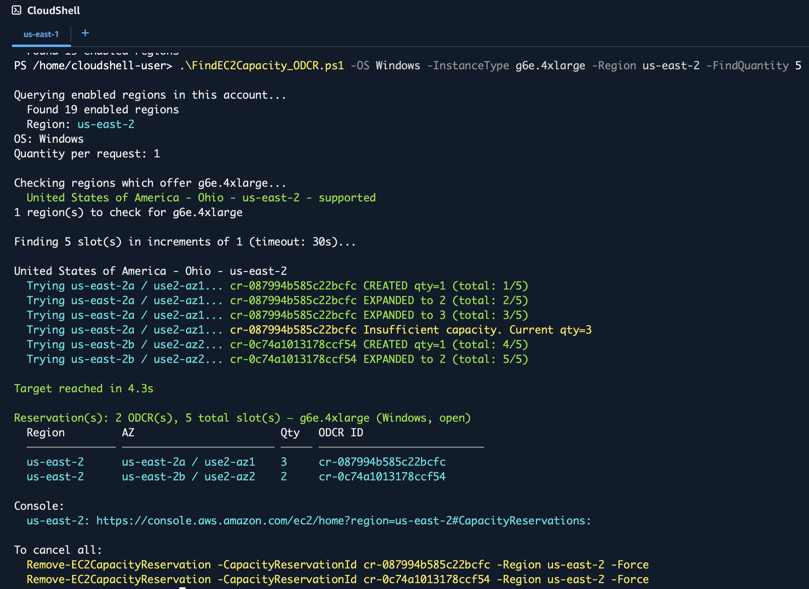

# Find EC2 Capacity with ODCR


Creates an [On-Demand Capacity Reservation](https://docs.aws.amazon.com/AWSEC2/latest/UserGuide/ec2-capacity-reservations.html) (ODCR) for a specified EC2 instance type.

You can then launch instances into the capacity reservation, stop or terminate, and launch new instances into the ODCR without losing the reserved capacity.

> ⚠️ **Billing:** You are billed at the on-demand rate from the moment the ODCR is created, even if no instance is running in it. Cancel the ODCR when done.

## Requirements

- PowerShell 7+ (pre-installed in AWS CloudShell)
- AWS.Tools.EC2 and AWS.Tools.Pricing modules (pre-installed in AWS CloudShell)
- AWS credentials with EC2 capacity reservation permissions

## Quick Start (AWS CloudShell)

1. Open [CloudShell](https://docs.aws.amazon.com/cloudshell/latest/userguide/getting-started.html) in the AWS Console
2. Launch PowerShell 7: `pwsh`
3. [Upload](https://docs.aws.amazon.com/cloudshell/latest/userguide/getting-started.html#folder-upload) [`FindEC2Capacity_ODCR.ps1`](./FindEC2Capacity_ODCR.ps1) to CloudShell
4. Run:
```powershell
.\FindEC2Capacity_ODCR.ps1 -OS Windows -InstanceType g7e.2xlarge -RegionGroup us
```

## Parameters

| Parameter | Default | Description |
|-----------|---------|-------------|
| `-InstanceType` | *(required)* | EC2 instance type to reserve |
| `-OS` | *(required)* | `Windows` or `Linux` (sets the reservation platform) |
| `-RegionGroup` | `all` | `us`, `us+` (Americas), `eu`, `ap`, or `all` |
| `-Region` | *(none)* | Specific region(s) to try (overrides `-RegionGroup`). Multiple: `us-east-1,us-east-2` (no spaces) |
| `-Zone` | *(none)* | Specific AZ(s) to try. Accepts names (`us-east-1a,us-east-2b`) or zone IDs (`use1-az1,use2-az2`). Overrides `-Region`/`-RegionGroup`. |
| `-Quantity` | `1` | Slots per single ODCR request. In `-TargetQuantity` mode, this is the increment size for each expansion attempt. |
| `-TargetQuantity` | *(none)* | Total slots to accumulate across AZs (with retries). Unlike `-Quantity` which is per-request, this is the overall target. Requires `-Region` or `-Zone`. |
| `-TargetTimeout` | `30` | Max seconds to spend accumulating capacity in `-TargetQuantity` mode |
| `-TargetQuantityInterval` | `10` | Seconds between retry attempts in `-TargetQuantity` mode |
| `-InstanceMatchCriteria` | `open` | `open` (any matching instance uses the reservation) or `targeted` (must specify CR ID at launch) |
| `-Sequential` | *(off)* | Tries AZs one at a time, stops on first success |

## Examples

### Single Run (default: parallel, or -Sequential)

Find capacity and create a single ODCR. Parallel mode tries all AZs at once and lets you pick; sequential stops on first success.

```pwsh
# Reserve Windows g7e capacity - check all US regions (parallel)
.\FindEC2Capacity_ODCR.ps1 -OS Windows -InstanceType g7e.2xlarge -RegionGroup us

# Reserve Windows p5 capacity - check all regions
.\FindEC2Capacity_ODCR.ps1 -OS Windows -InstanceType p5.4xlarge -RegionGroup all

# Reserve 4 Linux i4i.metal slots in us-east-1 or us-east-2
.\FindEC2Capacity_ODCR.ps1 -OS Linux -InstanceType i4i.metal -Quantity 4 -Region us-east-1,us-east-2

# Sequential mode - stops on first success
.\FindEC2Capacity_ODCR.ps1 -OS Windows -InstanceType g6e.4xlarge -RegionGroup all -Sequential

# Target specific AZs by name
.\FindEC2Capacity_ODCR.ps1 -OS Windows -InstanceType g7e.2xlarge -Zone us-east-1a,us-east-2a

# Target specific AZs by zone ID
.\FindEC2Capacity_ODCR.ps1 -OS Linux -InstanceType p5.4xlarge -Zone use1-az1,use2-az1
```

### TargetQuantity Mode (-TargetQuantity)

Accumulate a target number of slots by creating and expanding ODCRs. Retries periodically until the target is reached or timeout expires. Useful for scarce instance types where capacity trickles in over time.

```pwsh
# Need 10 g6e.xlarge in us-east-2. Retry for 10 minutes.
.\FindEC2Capacity_ODCR.ps1 `
    -OS Windows `
    -InstanceType g6e.xlarge `
    -Region us-east-2 `
    -TargetQuantity 10 `
    -TargetTimeout 600

# Need 4 p5.4xlarge in specific AZs. Retry every 60s for 1 hour.
.\FindEC2Capacity_ODCR.ps1 `
    -OS Windows `
    -InstanceType p5.4xlarge `
    -Zone us-east-1a,us-east-2b `
    -TargetQuantity 4 `
    -TargetTimeout 3600 `
    -TargetQuantityInterval 60
```

### After a successful reservation:

Launch instances into the ODCR via the [EC2 Console](https://console.aws.amazon.com/ec2/home#CapacityReservations:) or PowerShell:

```powershell
New-EC2Instance -Region us-east-2 -InstanceType g6e.xlarge -CapacityReservationTarget_CapacityReservationId cr-0abc123... ...
```

Cancel the ODCR when no longer needed (stops reservation billing; running instances continue to bill separately):
```powershell
Remove-EC2CapacityReservation -CapacityReservationId cr-0abc123... -Region us-east-2 -Force
```

## How It Works

### Parallel (default)
1. Queries enabled regions in your account
2. Builds region groups dynamically by prefix (future-proof for new regions)
3. Pre-checks instance type availability per region in parallel
4. Queries which AZs support the instance type (in parallel)
5. Fires ODCR creation requests across all supported AZs simultaneously
6. Displays results grouped by region with on-demand pricing per success
7. Prompts you to choose which reservations to keep (by number)
8. Automatically cancels any unchosen reservations
9. Enter to cancel all, or comma-separated numbers to keep (e.g. `1,3`)



### Sequential (-Sequential)
1. Same region and AZ discovery as parallel
2. Tries each AZ one at a time in priority order
3. Stops on first success with pricing displayed
4. No interactive selection

### TargetQuantity mode (-TargetQuantity)

Use when you need a large number of instances (e.g. multiple p5.4xlarge) or want to increase existing Capacity Reservations. The script creates an ODCR (if needed), and increases until the `-TargetQuantity` value is met or an `Insufficient capacity` message is returned, and then tries the next AZ. This minimizes the number of Capacity Reservations to manage. Re-running the script expands existing CRs rather than creating duplicates.

1. Finds existing active CRs matching the instance type and platform
2. Tries expanding existing CRs first (minimizes total reservations)
3. If no existing CR in an AZ, creates a new one
4. Expands in increments of `-Quantity` 
5. Retries all AZs at `-TargetQuantityInterval` seconds (capacity may free up)
6. Stops when target reached or `-TargetTimeout` (default 30 seconds) exceeded


### TargetQuantity Sample Output

```pwsh
.\FindEC2Capacity_ODCR.ps1 -OS Windows -InstanceType g6e.4xlarge -Region us-east-2 -TargetQuantity 5
```

Finding 5 g6e.4xlarge slots in us-east-2.




## Author

Craig Cooley coolcrai@ — Built with Kiro IDE + Claude Opus 4.6