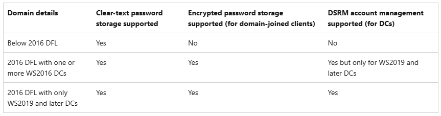

# Windows LAPS & AWS Microsoft Managed Active Directory
by Luciano Bernardes and Sassan Hajrasooliha

### Introduction
[Windows Local Administrator Password Solution](https://learn.microsoft.com/en-us/windows-server/identity/laps/laps-overview) (Windows LAPS) is a Windows feature that automatically manages and backs up the password of a local administrator account on your Microsoft Entra joined or Windows Server Active Directory-joined devices. You can also use Windows LAPS to automatically manage and back up the Directory Services Restore Mode (DSRM) account password on your Windows Server Active Directory domain controllers (DCs). An authorized administrator can retrieve the DSRM password and use it.

If you have self-managed Active directory, meaning you are running your domain controllers as Windows EC2 instances on AWS, the [considerations and steps](https://learn.microsoft.com/en-us/windows-server/identity/laps/laps-concepts-overview) to setup LAPS are not different from setting it up on-premises and all features of Windows LAPS are supported provided that your infrastructure meets their minimum requirements. For the remaining of this document we're going to assume that your environment runs with [AWS Managed Microsoft Active Directory](https://docs.aws.amazon.com/directoryservice/latest/admin-guide/directory_microsoft_ad.html).

### Legacy Microsoft LAPS background
Before Windows LAPS, Microsoft had provided a legacy version of the solution, often referred as _legacy Microsoft LAPS_. It fully works with AWS Managed AD and you can check more details about its implementation following the [How to Deploy Local Administrator Password Solution with AWS Microsoft AD](https://aws.amazon.com/blogs/security/how-to-deploy-local-administrator-password-solution-with-aws-microsoft-ad/) blog post.

The legacy solution requires a Microsoft LAPS Client Side Extension (CSE) installed on each server and it stores the local administrator password in clear-text in AD database, secured by Active Directory ACLs.

### Windows LAPS requirements vs AWS Managed AD design

Aside from the regular clear-text password storage support secured by Active Directory ACLs, Windows LAPS provides enhanced features, such as encrypted password storage support and DSRM password management. It can also leverage either Microsoft Entra ID or Active Directory as the backup directory and integrate with Microsoft Intune.

Regarding OS level support, the solution covers Windows Server 2019, 2022, and 2025. Anything older than Windows Server 2019, should rely on the legacy Microsoft LAPS solution.

Having Active Directory as the LAPS password repository and aiming to enable the enhanced features, Windows LAPS requires Domain Functional Level 2016 and domain controllers running on Windows Server 2019 or newer (Image 1). More information [here](https://learn.microsoft.com/en-us/windows-server/identity/laps/laps-scenarios-windows-server-active-directory#domain-functional-level-and-domain-controller-os-version-requirements).

_Image 1 - Table summarizing the supported-or-not scenarios ([from Microsoft docs](https://learn.microsoft.com/en-us/windows-server/identity/laps/laps-scenarios-windows-server-active-directory#domain-functional-level-and-domain-controller-os-version-requirements))_

AWS Managed AD currently runs under the Domain and Forest Functional Level 2012 R2 and the domain controllers run on Windows Server 2019. Consequently, the enhanced features are not supported by AWS Managed AD. Check the [Getting started with AWS Managed Microsoft AD](https://docs.aws.amazon.com/directoryservice/latest/admin-guide/ms_ad_getting_started.html) documentation to know more.

## Windows LAPS in legacy Microsoft LAPS emulation mode

Windows LAPS has a feature to be backward-compatible with the legacy LAPS to provide the same feature set like regular clear-text password storage support secured by Active Directory ACLs. 

As _highlighted_ in [Get started with Windows LAPS in legacy Microsoft LAPS emulation mode](https://learn.microsoft.com/en-us/windows-server/identity/laps/laps-scenarios-legacy) documentation:

_You can set up Windows Local Administrator Password Solution (Windows LAPS) to honor legacy Microsoft LAPS Group Policy settings, but with some restrictions and limitations. The feature is called legacy Microsoft LAPS emulation mode. You might use emulation mode if you migrate an existing deployment of legacy Microsoft LAPS to Windows LAPS._

Therefore, considering the current AWS Managed AD underlying architecture, the emulation mode of Windows LAPS is the way to go within AWS Managed AD and it requires the following major steps to have it set up:

- Set up the environment initially following steps 2 to 4 from [legacy Microsoft LAPS setup instructions blog](https://aws.amazon.com/blogs/security/how-to-deploy-local-administrator-password-solution-with-aws-microsoft-ad/), which are:

  - Extending the schema (step 2). you can check your schema extension file with the [Legacy Microsoft LAPS schema element table](https://learn.microsoft.com/en-us/windows-server/identity/laps/laps-technical-reference#windows-laps-schema-vs-legacy-microsoft-laps-schema) to ensure it has all it needs.

  - Configuring AD permissions (step 3)

  - Configuring LAPS GPO (step 4)

- (Optional) Install the legacy [Microsoft LAPS Client Side Extension (CSE)](https://www.microsoft.com/en-us/download/details.aspx?id=46899) on Windows Server 2016 or older

- *Do not* install the legacy Microsoft LAPS Client Side Extension (CSE) on Windows Server 2019 or newer

- (Optional) Use the legacy `Get-AdmPwdPassword -ComputerName <SERVERNAME>` PowerShell cmdlet to retrieve the password when running on Windows Server 2016 or older

- Use the `Get-LapsADPassword -Identity <SERVERNAME> -AsPlainText` PowerShell cmdlet to retrieve the password when running on Windows Server 2019 or newer

## Conclusion

Windows LAPS in legacy Microsoft LAPS emulation mode is a supported way to use the solution, considering AWS Managed AD limitations. The benefit is that customers would not have to install the CSE on Windows Server 2019 or newer. From a supportability standpoint, it is currently advisable to utilize the legacy Microsoft LAPS emulation mode when working with AWS Managed Active Directory. This approach provides the balance of functionality and support.