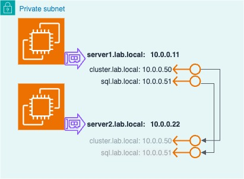
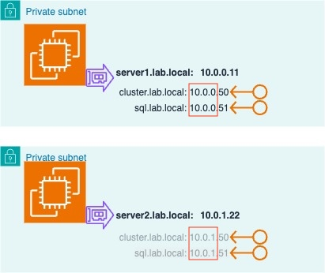
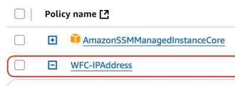
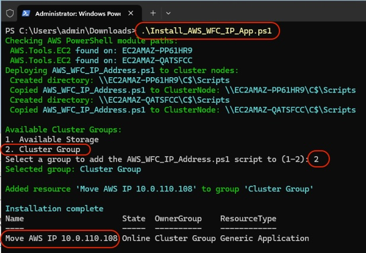
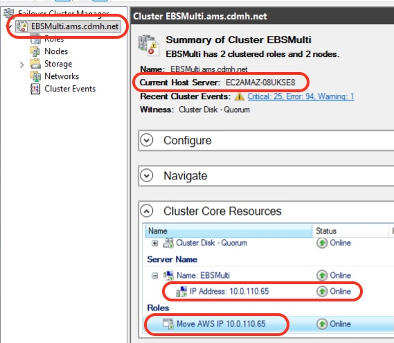
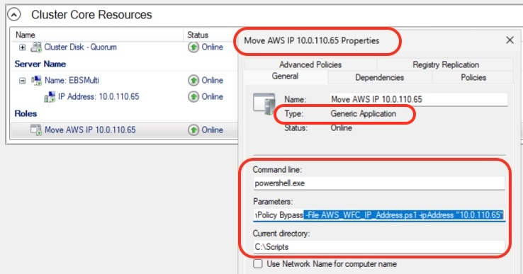
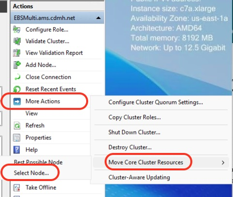
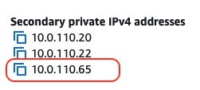
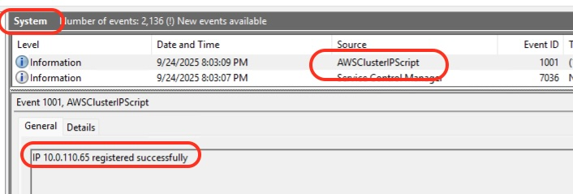

# Use Case: Single-Subnet Windows Failover Clustering in AWS

## Overview

The **WFC-IP** package enables customers to run Windows Failover Clusters (WFC) in AWS using a **single-subnet configuration** — replicating the same IP failover behavior they use on-premises. This eliminates the need to redesign networking or modify application configurations when migrating clustered workloads to AWS.

## Problem Statement

When migrating Windows Failover Clusters from on-premises to AWS, customers face a fundamental networking difference:

|  | On-Premises | AWS (Default) |
| --- | --- | --- |
| **IP Failover** | Shared IP moves between nodes automatically | IP bound to a single ENI — cannot float between instances |
| **Subnet Model** | Single subnet, single IP | Multi-subnet required (one IP per node/subnet) |
| **DNS Behavior** | Static — one IP, no DNS updates needed | Requires DNS updates or multi-record registration |
| **App Changes** | None | May require connection string changes, TTL tuning, or client-side retry logic |

AWS recommends **multi-subnet clustering** as the default and preferred approach — it's simpler to configure, doesn't require IAM policies or custom scripts, and works out of the box with WFC. However, some customers cannot use multi-subnet configurations.

## When This Solution Applies

This package is intended for customers who meet **one or more** of the following criteria:

### 1. Application Compatibility Constraints

- Legacy applications hardcoded to a single IP address that cannot be modified
- Applications that do not support multi-record DNS resolution or SQL Server Multi-Subnet Failover listeners
- Third-party software with strict single-IP requirements for licensing or configuration

### 2. Migration Fidelity Requirements

- Customers performing "lift-and-shift" migrations who need to minimize changes to pass validation/certification
- Regulated environments where any change to the clustering configuration requires a full re-certification cycle (e.g., healthcare, financial services)
- Large-scale migrations where per-cluster DNS/app changes create unacceptable project risk

### 3. Operational Simplicity Preferences

- Teams accustomed to single-subnet clustering who want to avoid retraining or rewriting runbooks
- Environments where DNS TTL tuning is not permitted by network/security teams
- Customers with client applications that cache DNS aggressively and cannot be reconfigured

## Solution Summary

The WFC-IP package provides:

1. **An IP Management Script (**`WFC_IP_Address.ps1`**)** — Runs as a Generic Application cluster resource on the active node. Uses `Register-EC2PrivateIpAddress` to assign the cluster's secondary IP to the active instance's ENI during failover.
2. **An Installation Script (**`Install_AWS_WFC_IP_App.ps1`**)** — Automates the creation of cluster resources for IP management across cluster groups.
3. **An IAM Policy Template (**`WFCENIPolicy.json`**)** — Scoped permissions for ENI modification, limited to the specific ENIs in the cluster.

## Trade-offs vs. Multi-Subnet (Default)

| Consideration | Multi-Subnet (Preferred) | Single-Subnet (This Solution) |
| --- | --- | --- |
| **Complexity** | Low — native WFC support | Moderate — requires IAM role, scripts, and monitoring |
| **AWS API Dependency** | None | Yes — failover depends on EC2 API availability |
| **IAM Configuration** | Not required | Required — ENI modify permissions per cluster |
| **DNS Changes** | Yes — multi-record or TTL tuning | None — single static IP |
| **App Changes** | May require connection string updates | None |
| **Failover Speed** | Instant for multi-IP aware clients; single-IP clients depend on DNS TTL expiry | Seconds (API call + IP registration) — no DNS dependency |
| **Maintenance** | None | Script updates, IAM policy management |

## Recommended Decision Framework

```
┌─────────────────────────────────────────────────────┐
│ Can the application support multi-subnet WFC?       │
│                                                     │
│   YES → Use multi-subnet (default/preferred)        │
│                                                     │
│   NO  → Does the customer accept the added          │
│         operational complexity (IAM, scripts)?      │
│                                                     │
│         YES → Deploy WFC-IP single-subnet           │
│         NO  → Evaluate application refactoring      │
└─────────────────────────────────────────────────────┘
```

## Target Audience

- AWS Solutions Architects advising customers on WFC migration strategies
- Customers migrating SQL Server FCI, File Server clusters, or other WFC-dependent workloads
- Migration teams performing large-scale Windows infrastructure moves to AWS

## Success Criteria

- Cluster IP fails over between nodes without DNS changes
- Application connectivity is maintained through failover events
- Failover completes within the same time window as on-premises (typically < 30 seconds)
- Events are logged to Windows System log for auditability

---

## Background

[**Windows Failover Clustering (WFC)**](https://learn.microsoft.com/en-us/windows-server/failover-clustering/deploy-two-node-clustered-file-server?tabs=server-manager) was originally designed to run with two or more Windows Servers connected to shared SAN volumes and shared IP addresses which were moved to active cluster nodes as needed.

The 'active' node controlled the storage volumes, network name, and IP address.  In the event of a failover, the storage volumes, network name, and IP address automatically moved to the 'failover' server.  In this example, name 'sql.lab.local' resolves to 10.0.0.51 regardless of which cluster server is hosting the application:



## Customer Problem - WFC in AWS

In AWS, VPC networking requires IP addresses to be assigned to an ENI before the OS can use it, and an IP can only be assigned to 1 ENI.  This prevents the Windows Failover Cluster from moving the clustered application's IP to the failover node. A common workaround is to configure a [multi-subnet cluster](https://learn.microsoft.com/en-us/sql/sql-server/failover-clusters/windows/sql-server-multi-subnet-clustering-sql-server?view=sql-server-ver16) where the clustered application has a unique IP for each subnet.

In this example - **sql1.lab.local** resolves to **10.0.0.51** when running on **server1**, and **10.0.1.51** when running on **server2**.  The DNS client can be configured to update the DNS registration during a failover -or- register both IP address, and rely on the client application to determine the active server.



For customers moving Windows Clusters from on-prem to AWS, this change can require customers to examine DNS TTLs or make untested changes to their application.

## Solution - WFC Single Subnet config in AWS

AWS VPC networking allows 'secondary' IP addresses to be reassigned to another ENI with a simple API call. In Windows, we can run the [Register-EC2PrivateIpAddress](https://docs.aws.amazon.com/powershell/v5/reference/?page=Register-EC2PrivateIpAddress.html&tocid=Register-EC2PrivateIpAddress) command to re-assign a [secondary IP addresses](https://docs.aws.amazon.com/AWSEC2/latest/UserGuide/instance-secondary-ip-addresses.html) during a failover.   For example:

From **server1**, run `Register-EC2PrivateIpAddress` to assign `10.0.0.51` to **server1**'s ENI:

*  ```Register-EC2PrivateIpAddress -NetworkInterfaceId eni-abcdef01234567890 -PrivateIpAddress 10.0.0.51```

...or from **server2**, run `Register-EC2PrivateIpAddress` to move `10.0.0.51` to **server2**'s ENI:

*  ```Register-EC2PrivateIpAddress -NetworkInterfaceId eni-021345abcdef6789 -PrivateIpAddress 10.0.0.51```

This enables the clustered application to listen on the same IP address regardless of which server is hosting the sql application, which avoids DNS updates and client configuration.

### Configuration Overview

The basic components needed to manage EC2 IP address from WFC are:
1) An IAM role attached to the EC2 Instance with permission to modify the AWS network interfaces (ENIs).
2) A PowerShell script which runs on the active Windows server to register the IP Address.

#### IAM Role

Each EC2 Instance requires AWS credentials to run `Register-EC2PrivateIpAddress`. The best way is to attach an IAM Role to the EC2 Instance with an inline policy allowing ENI modification, and limiting access to the specific ENIs in the cluster.

#### IP Management Script

The IP Management script will run [Register-EC2PrivateIpAddress](https://docs.aws.amazon.com/powershell/v5/reference/?page=Register-EC2PrivateIpAddress.html&tocid=Register-EC2PrivateIpAddress) to assign the Cluster IP address to active ENI.  The script can be added to multiple Cluster Groups and will periodically monitor the ENI IP address.  For example, the **Cluster Core** and **SQL Server** resource groups would each have a resource that runs the IP Management Script (WFC_IP_Address.ps1).

The `WFC_IP_Address.ps1` script does the following:

1) Queries the ENI ID of the EC2 Instance it's running on using IMDSv1 or IMDSv2.
2) Registers the Cluster IP Address to the ENI of the EC2 Instance.
3) Confirms the IP Address was successfully registered to the ENI.
4) Writes events to the **Windows System log** under the topic **AWSClusterIPScript**
5) Confirms the cluster IP Address is registered to the ENI every 2 minutes.  This keeps the WFC script resource in an 'Online' status. If the script fails to detect the IP address on the ENI, it logs a Windows event and quits.  WFC will re-run the script based on the cluster settings.

#### Installation Script

The Installation script is run by an admin to create a Cluster Resource in the specified Cluster Group which runs `WFC_IP_Address.ps1` to manage the Cluster IP address in the Resource Group.
The `Install_AWS_WFC_IP_App.ps1` script does the following:
1) Queries the Cluster Nodes (server names)
2) Copies the IP Management Script (`WFC_IP_Address.ps1`) to `C:\Scripts` on each cluster node.
3) Queries the list of Cluster Groups and prompts the admin to select one.
4) Determines the IP address in the selected Cluster Group.
5) Creates an "Generic Application" Cluster Resource in the selected Cluster Group that runs the IP Management Script.

## Configuration Steps

### Pre Requisites

* Two or more EC2 Windows EC2 Instances running Windows Server 2022 or 2025 running on the same VPC subnet.
* An IAM Role (Instance Profile) attached to both Instances (should be a unique IAM role per WFC).
* AWS.Tools for PowerShell Installed (installed by default on AWS AMIs)
* Windows Failover Clustering installed and configured.
* The IP address for each Cluster Resource Group changed to 'Static' vs 'DHCP'
* Outbound network connectivity to run AWS API.

1) Create an IAM Role for the Windows Failover Cluster and assign it to each Instance.  Add an inline IAM policy to allow the Instances to update their ENIs.  You can use [WFCENIPolicy.json](https://github.com/aws-samples/technical-notes-for-microsoft-workloads-on-aws/blob/main/docusaurus/docs/EC2%20Windows/Guides/WFC-Single-Subnet-IP-Failover/WFCENIPolicy.json) and update the ENI IDs for each server in the cluster.

Example:


2) Download these 2 PowerShell scripts to one of the Windows instances. (eg C:\users\admin\Downloads)
* [Install_AWS_WFC_IP_App.ps1](https://github.com/aws-samples/technical-notes-for-microsoft-workloads-on-aws/blob/main/docusaurus/docs/EC2%20Windows/Guides/WFC-Single-Subnet-IP-Failover/Install_AWS_WFC_IP_App.ps1)
* [AWS_WFC_IP_Address.ps1](https://github.com/aws-samples/technical-notes-for-microsoft-workloads-on-aws/blob/main/docusaurus/docs/EC2%20Windows/Guides/WFC-Single-Subnet-IP-Failover/AWS_WFC_IP_Address.ps1)

3) Open a PowerShell prompt with Admin permissions and run `Install_AWS_WFC_IP_App.ps1` for each Cluster Group.
* run once and select the WFC group named **Cluster Group** which is the WFC management group which hosts the Cluster Name, IP address, and Quorum Drive
* run again for any other WFC groups.



**4)** Test failover:

   **a)** Open Cluster management (cluadmin.msc).  Note the current Host Server and the IP address (should be set to 'Static').

   

   **b)** Expand the 'Cluster Core Resources' at the bottom, and locate the Generic Application named **Move AWS IP x.x.x.x**.  Note the IP address is in the Command Parameters and the Current Directory is set to C:\Scripts.



   **c)** Move the Core Cluster Resources to the other Cluster Node.



   **d)** In the EC2 Console, check the secondary IPs assigned to each EC2 Instance and find the IP address of the Cluster Core.



   **e)** Move the Cluster Core resources back to the original EC2 Instance.  Open the Windows Event viewer and expand the System Event Log.  Note the registration was logged.



   **f) Optional** - In the EC2 Console, try unassigning the Secondary IP from the ENI or removing the IAM role from the current Instance.
