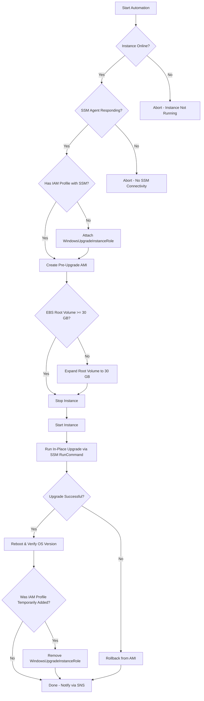

# Upgrade Flowchart

The diagram below summarizes the decision logic embedded in the SSM Automation document.

## Key Decision Points

| Step | Decision | Pass Criteria |
|------|----------|---------------|
| Instance Online | EC2 Running state | `InstanceStateName = running` |
| SSM Connectivity | SSM Agent active | `PingStatus = Online` |
| IAM Profile | Has SSM permissions | Instance profile includes `AmazonSSMManagedInstanceCore` or equivalent |
| Volume Size | Root EBS >= 30 GB | `VolumeSize >= 30` |
| Upgrade Result | Windows Setup exit code | Exit code `0` or Windows version matches 2019 |
