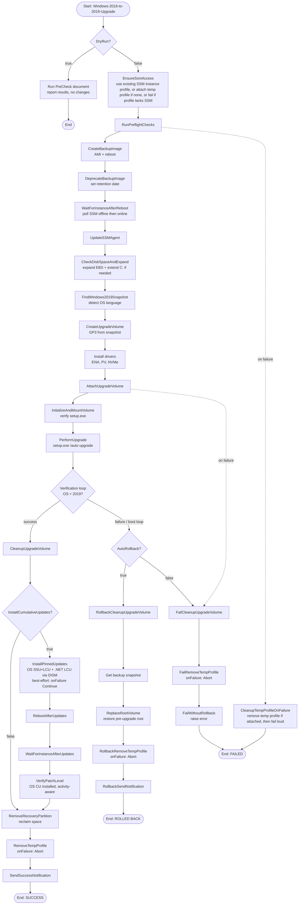

# Automation Flowchart

This diagram shows the full execution flow of the upgrade automation, including the DryRun path, the happy path, rollback, and failure cleanup paths.

## Reading the Diagram

| Path | Description |
|------|-------------|
| **DryRun=true** | Runs pre-flight checks only, never modifies the instance |
| **Happy path** (solid lines down) | Full upgrade: backup → drivers → upgrade → patch → cleanup |
| **Rollback path** (AutoRollback=true) | On upgrade failure: restore root volume from backup AMI snapshot |
| **Failure path** (AutoRollback=false) | On upgrade failure: clean up volumes and profiles, then fail loud for investigation |
| **Dotted lines** | Failure cleanup shortcuts — any step that fails routes to the appropriate cleanup path |

### Key Design Principles

- **No orphaned resources:** Every path (success, failure, rollback) cleans up the upgrade EBS volume and removes any temporary instance profile the automation attached.
- **Patching is best-effort:** The `InstallPinnedUpdates` → `VerifyPatchLevel` segment uses `onFailure: Continue`. A patch failure never aborts the run — the OS upgrade already succeeded.
- **Temp profile always removed:** The `RemoveTempProfile` step uses `onFailure: Abort` — if profile removal itself fails (rare: throttling, transient API error), the automation halts loudly so you know to clean up manually.
- **Existing instance profiles are never modified:** If the instance already has an instance profile (with or without SSM permissions), the automation either uses it or fails with guidance — it never attaches/detaches the instance's own profile.
