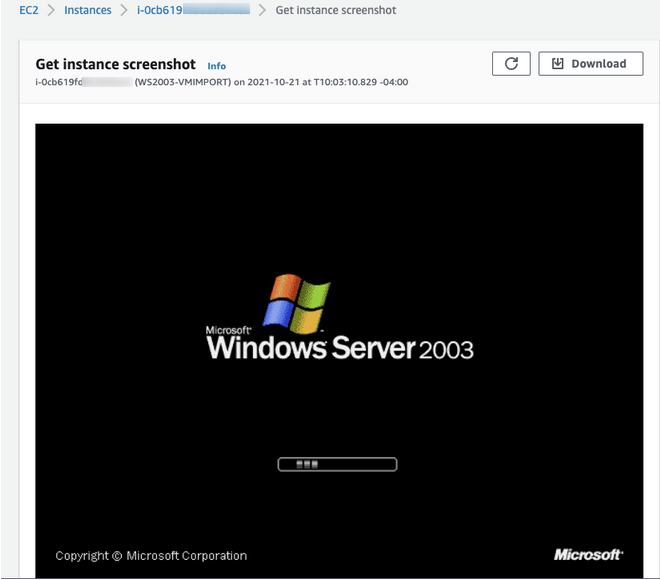

<<<<<<< HEAD
# Windows Server 2003 Migration

I recently had a colleague ask me about migration of a Microsoft Windows Server 2003 virtual machine.  I spent ... so ... many years staring at that UI, I almost felt nostalgic in a way to see if it could still be done. As of the time of writing, Windows Server 2003 is listed as a supported operating system for AWS MGN and it is possible to use VM import to convert the machine from VMware or Hyper-V to EC2.  I thought I would document both approaches below.

### AWS VM Import
In this approach, we use the AWS VM Import service to convert the virtual machine from Hyper-V to EC2.  Why?   Migration using CloudEndure will require at a minimum .NET 3.5 to be installed on the server.  It is possible that there is a reluctance to install anything on the server itself.  In that case, AWS VM Import is a good path.

Check the following URL for the prerequisites:  https://docs.aws.amazon.com/vm-import/latest/userguide/vmie_prereqs.html

Here are the basic steps using a S3 multi-part upload to move the image file into S3 for conversion

1. Get the MD5 hash of the image file
```
openssl md5 -binary WS2003.vhdx | base64

XXeDZzPSFcKlIM4JIIpyeQ==
```

2. This particular file was only 2GB but I'm splitting it out into 512MB chunks for illustration purposes.

```
split -b 512m WS2003.vhdx WS2003.vhdx.part-
```
This will result in WS2003.vhdx-part-aa ... part-ab, etc.

3. Create the S3 multi-part upload and use the MD5 hash previously generated

```
aws s3api create-multipart-upload \
> --bucket sbx-bucket-mhspence \
> --key WS2003.vhdx \
> --metadata md5=XXeDZzPSFcKlIM4JI
```
This will return an UploadId

```
{
    "ServerSideEncryption": "AES256",
    "Bucket": "<bucket>",
    "Key": "WS2003.vhdx",
    "UploadId": "<uploadid>"
}
```

4. Upload each part of the image file.   I created bash environment variables for the bucket, key, and uploadid.

```
aws s3api upload-part --bucket $bucket --key $key --part-number 1 --body WS2003.vhdx.part-aa --upload-id $upload
```

This will return an ETag in the response

```
{
    "ServerSideEncryption": "AES256",
    "ETag": "\"f8f6108e716035b4d0e1ef800cd87952\""
}
```

Just rinse and repeat for each and every part

5. Once all parts have been uploaded complete the multi-part upload.   Create a JSON file that has all the parts in this syntax below so we can put humpty-dumpty back together again.

```
{
"Parts" : [
    {
       "ETag" : "<ETag value>"
       "PartNumber" : <number>
    }
 ]
}
```

6. Complete the S3 multi-part upload
```
aws s3api complete-multipart-upload --multipart-upload file://upload-parts.json --bucket $bucket --key $key --upload-id $uploadid
```

7. Create the VM import image task
```
aws ec2 import-image --disk-containers Format=vhd,UserBucket="{S3Bucket=<bucket>,S3Key=WS2003.vhdx}" --region us-east-1
```
Once the conversion is complete, launch a new instance from the AMI



There we go... Windows 2003...


### Application Migration Service (MGN)

I thought it would be prudent to go ahead and run the same migration test with MGN against a Windows 2003 Enterprise R2 x64 virtual machine. Always be sure to check the MGN [Supported Operating Systems](https://docs.aws.amazon.com/mgn/latest/ug/Supported-Operating-Systems.html) for compatibility.

There are a few items to remember:

- Microsoft Windows 2003 uses a special version of the AWS Replication agent that is only valid for legacy Windows OSs (AwsReplicationWindowsLegacyInstaller.exe).  That installation file will need to be pulled manually from: https://aws-application-migration-service-(region).s3.amazonaws.com/latest/windows_legacy/AwsReplicationWindowsLegacyInstaller.exe
     
- Microsoft Windows 2003 (32-bit and 64-bit) requires .Net Framework version 3.5 to be installed by the end user
     
- The Nitro instance family can only be used with Windows Server 2008 R2 and upwards, so you will have to use Xen based instances (i.e. t2 series).

=======
# Restrict EC2 IAM role permission to specific Windows users for AWS Systems Manager. 
by Siavash Irani

## Background
A customer in consulting segment wants to use AWS Systems manager session manager for managing their ec2 instances.

## Challenge
One of the requirement of AWS systems manager is to have an IAM role attached to the instance. This allows ssm-user to interact with AWS using the AWS role permissions. The problem customer had was if they attach an IAM role to the Windows instance, not only it allows ssm-user to interact with AWS, but also any other Windows user which logs in to the instance will have access based on the IAM role. 

## Solution
The proposed solution was to use Windows firewall to block traffic to IMDS(instance meta-data service) to the specific windows user. 

## Solution diagram


## Workflow
1. Use WF.msc to create a new oubound rule. Add 169.254.169.254 as remote address. 


2. Block the connection


3. Apply the rule to everyone and exclude the rule for other users, like System, ssm-user,administrator. 


## Benefits
With this method, customer is able to grant permissions to ssm-user and then block access to other Windows users.

## Potential Cost
There is no cost to create this solution, it’s just a configuration in windows. 
>>>>>>> 295fec462f0318088d96bc2fab87a51ead67fad2
