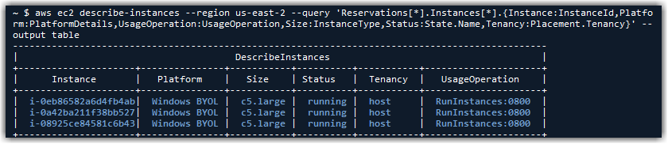
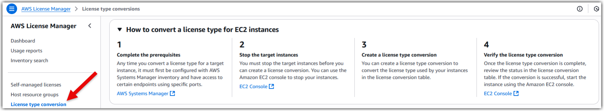
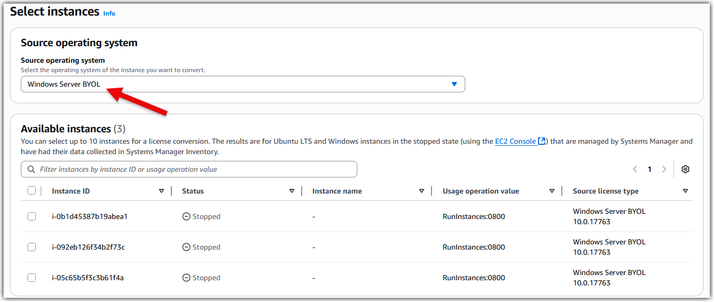
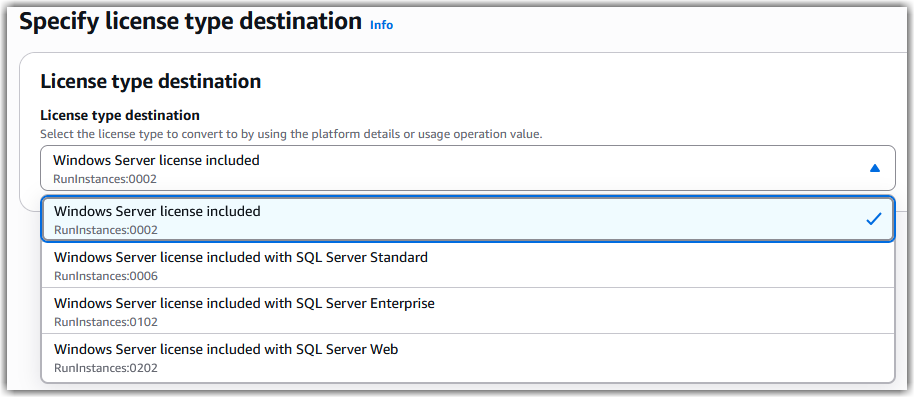
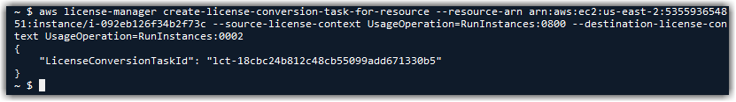
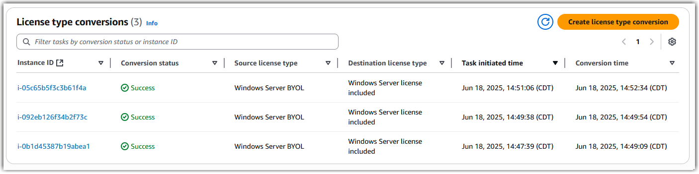
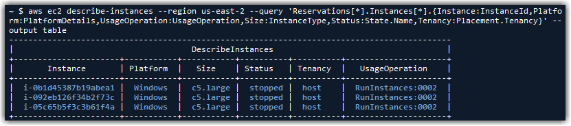
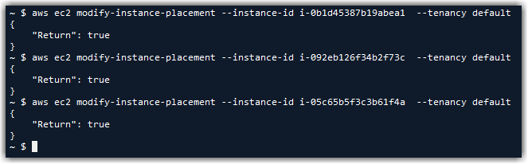
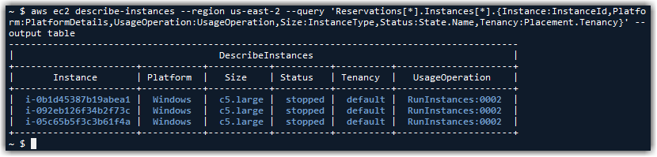

# Migrate from BYOL with Dedicated Hosts to AWS License Included in Shared Tenancy
by Chase Lindeman

## Introduction

For Microsoft workloads, [EC2 Dedicated Hosts](https://aws.amazon.com/ec2/dedicated-hosts/) have been used in AWS as a means to maintain compliance with Microsoft's dedicated infrastructure licensing requirements for products that do not have License Mobility benefits. 

Services Provide Licensing Agreement (SPLA) licensing for Bring Your Own License (BYOL) also requires Dedicated Hosts for products licensed by core or processor, such as Windows Server and SQL Server. However, in October 2022, [Microsoft announced](https://partner.microsoft.com/en-ie/blog/article/new-licensing-benefits-make-bringing-workloads-and-licenses-to-partners-clouds-easier) service providers will no longer be able to use their own SPLA licenses in the environments of Listed Providers (Amazon, Google, Alibaba, Microsoft) after September 30, 2025.

These changes are noted in the [Service Provider Use Rights](https://www.microsoft.com/licensing/spur/product/universallicenseterms/all).

> **Use of Listed Providers**
>
> Customer may use a Data Center Provider (for DCP eligible Products) or an Outsourcing Company that is a Listed Provider (or that uses a Listed Provider as a means of providing services to Customer) through September 30, 2025.

### I'm using SPLA on AWS today, what do I need to do to maintain compliance before the SPLA changes take effect on October 1, 2025?

Service Providers currently using SPLA licensing in AWS have been advised by Microsoft to utilize the License Included offerings available from AWS to maintain compliance, as noted in Microsoft's [license change announcement](https://partner.microsoft.com/en-ie/blog/article/new-licensing-benefits-make-bringing-workloads-and-licenses-to-partners-clouds-easier): 

> Any SPLA partner impacted by this change has until September 30, 2025 to transition from a Listed Provider for SPLA outsourced hosting or to **license directly from the Listed Provider outside of their SPLA**. Listed Providers include Alibaba, Amazon Web Services, Google, and Microsoft, and any outsourcer using a Listed Provider as part of the applicable outsourcing service. **Customers that want to use a Listed Provider for outsourcing can acquire licenses directly from the Listed Provider.**

### How do I switch my licensing from BYOL to AWS License Included?

In order to make the appropriate license conversions, you must first understand [AWS billing codes](https://docs.aws.amazon.com/AWSEC2/latest/UserGuide/billing-info-fields.html#billing-info). These billing codes are what determine if your EC2 instance is charged for the associated Microsoft license and are crucial for maintaining license compliance.

| Platform Details | Usage Opertaions |
| --- | --- |
| Windows| RunInstances:0002|
| Windows BYOL | RunInstances:0800|
| Windows with SQL Server Enterprise| RunInstances:0102 |
| Windows with SQL Server Standard | RunInstances:0006 |
|SQL Server Enterprise |RunInstances:0100|
|SQL Server Standard |RunInstances:0004|
|SQL Server Web|RunInstances:0200|

It's important to get an inventory of your environment to help understand the appropriate billing code changes which will be necessary for each EC2 instance. The following command can be run using AWS CLI or PowerShell to see details about each EC2 instance, their current billing codes, and tenancy.

*Note the sample command is specific to the us-east-2 region. Edit the region to see EC2 instances in each location.*

import Tabs from '@theme/Tabs';
import TabItem from '@theme/TabItem';

<Tabs
    groupId="cmtool"
    defaultValue="AWS CLI"
    values={[
        {label: 'AWS CLI', value: 'AWS CLI'},
        {label: 'PowerShell', value: 'PowerShell'},
    ]}>
<TabItem value="AWS CLI">
```
aws ec2 describe-instances --region us-east-2 --query 'Reservations[*].Instances[*].{Instance:InstanceId,Platform:PlatformDetails,UsageOperation:UsageOperation,Size:InstanceType,Status:State.Name,Tenancy:Placement.Tenancy}' --output table
```
</TabItem>
<TabItem value="PowerShell">

```
(Get-EC2Instance -Region us-east-2).Instances | 
Format-Table @{Name='Instance';Expression={$_.InstanceId}}, 
             @{Name='Platform';Expression={$_.PlatformDetails}}, 
             @{Name='UsageOperation';Expression={$_.UsageOperation}}, 
             @{Name='Size';Expression={$_.InstanceType}}, 
             @{Name='Status';Expression={$_.State.Name}}, 
             @{Name='Tenancy';Expression={$_.Placement.Tenancy}}
```

</TabItem>
</Tabs>



In this example, we can see the `Usage Operation` is listed as `RunInstances:0800`, meaning these EC2 instance are customer images which are not using AWS provided licenses. By changing each EC2 instance's billing code to ``RunInstances:0002``, it will begin charging for the Windows Server license as part of the EC2 instance cost. If you're using both Windows Server and SQL Server on the same EC2 instance, you'll need to use the appropriate Usage Operation billing code to account for both licenses.

Once you understand which billing code changes will need to be applied to each EC2 instance, you can use the AWS License Manager console to [convert the licenses.](https://docs.aws.amazon.com/license-manager/latest/userguide/conversion-procedures.html) 



By selecting ``Windows Server BYOL`` in the drop down, you'll be able to see the eligible resources. If you're having trouble finding your resources when using the License Manager console, be sure to check the [Prerequisites](https://docs.aws.amazon.com/license-manager/latest/userguide/conversion-prerequisites.html) and verify your resources are both in a **stopped** state and are reporting as Managed Instances to Systems Manager.



Once you've selected the resources you want to convert, you'll be able to designate the license type destination.



If you prefer the AWS CLI, the following examples can be used for converting BYOL to AWS License Included. Be sure to input the correct ``instance ARN``, not the ``instance ID``.

#### Convert Windows Server from BYOL to license included

<Tabs
    groupId="cmtool"
    defaultValue="AWS CLI"
    values={[
        {label: 'AWS CLI', value: 'AWS CLI'},
        {label: 'PowerShell', value: 'PowerShell'},
    ]}>
<TabItem value="AWS CLI">

```
aws license-manager create-license-conversion-task-for-resource \
	--resource-arn <instance_arn> \
	--source-license-context UsageOperation=RunInstances:0800 \
	--destination-license-context UsageOperation=RunInstances:0002
```
</TabItem>
<TabItem value="PowerShell">

```
New-LICMLicenseConversionTaskForResource `
    -ResourceArn '<instance_arn>' `
    -SourceLicenseContext_UsageOperation 'RunInstances:0800' `
    -DestinationLicenseContext_UsageOperation 'RunInstances:0002'
```

</TabItem>
</Tabs>


#### Convert both Windows Server and SQL Server Standard from BYOL to license included

<Tabs
    groupId="cmtool"
    defaultValue="AWS CLI"
    values={[
        {label: 'AWS CLI', value: 'AWS CLI'},
        {label: 'PowerShell', value: 'PowerShell'},
    ]}>
<TabItem value="AWS CLI">
```
aws license-manager create-license-conversion-task-for-resource \
	--resource-arn <instance_arn> \
	--source-license-context UsageOperation=RunInstances:0800 \
	--destination-license-context UsageOperation=RunInstances:0006
```
</TabItem>

<TabItem value="PowerShell">

```
New-LICMLicenseConversionTaskForResource `
    -ResourceArn '<instance_arn>' `
    -SourceLicenseContext_UsageOperation 'RunInstances:0800' `
    -DestinationLicenseContext_UsageOperation 'RunInstances:0006'
```

</TabItem>
</Tabs>

#### Convert both Windows Server and SQL Server Enterprise from BYOL to license included

<Tabs
    groupId="cmtool"
    defaultValue="AWS CLI"
    values={[
        {label: 'AWS CLI', value: 'AWS CLI'},
        {label: 'PowerShell', value: 'PowerShell'},
    ]}>
<TabItem value="AWS CLI">
```
aws license-manager create-license-conversion-task-for-resource \
	--resource-arn <instance_arn> \
	--source-license-context UsageOperation=RunInstances:0800 \
	--destination-license-context UsageOperation=RunInstances:0102
```
</TabItem>
<TabItem value="PowerShell">

```
New-LICMLicenseConversionTaskForResource `
    -ResourceArn '<instance_arn>' `
    -SourceLicenseContext_UsageOperation 'RunInstances:0800' `
    -DestinationLicenseContext_UsageOperation 'RunInstances:0102'
```

</TabItem>
</Tabs>




The license conversion only takes a few seconds to complete. Once the conversions are finished, you'll be able to see a log in the License Manager console.



### I'm finished converting my licenses, how do I migrate off my Dedicated Hosts?

Now that the license conversions have been successfully applied, you can focus on changing the EC2 tenancy. Review your inventory again, you should see your resources are now using the correct new billing codes, but the tenancy will still be listed as `host`. 



Unlike the license conversion, the process to change the EC2 tenancy can only be done through commands usings AWS CLI or PowerShell. Use the following command for each EC2 instance to change the tenancy to `default`.

<Tabs
    groupId="cmtool"
    defaultValue="AWS CLI"
    values={[
        {label: 'AWS CLI', value: 'AWS CLI'},
        {label: 'PowerShell', value: 'PowerShell'},
    ]}>
<TabItem value="AWS CLI">
```
aws ec2 modify-instance-placement --instance-id <instance_id> --tenancy default
```
</TabItem>

<TabItem value="PowerShell">
```
Edit-EC2InstancePlacement `
    -InstanceId <instance_id> `
    -Tenancy default
```

</TabItem>
</Tabs>



Once all your tenancy conversions are complete, review your EC2 inventory again to verify all resources are using the correct billing codes and display `default` tenancy. 



**Warning**: Verify there are no instances with Usage Operation ``RunInstances:0800`` using ``default`` tenancy; starting these instances would break Microsoft's licensing terms. Conversely, any EC2 instances changed to SQL Server License Included should not be started on ``host`` tenancy; starting these instances would also break Microsoft's licensing terms.

Once verification is complete, each of the EC2 instances can now be started and will come online in the default/shared tenancy environment. The Dedicated Hosts should now be empty and can be released.


## Conclusion

In this guide, we provided information to help you migrate from BYOL on Dedicated Hosts to AWS License Included on shared tenancy. These changes will help you adhere to Microsoft's licensing terms for your Microsoft workloads on AWS.

AWS has significantly more services, and more features within those services, than any other cloud provider, making it faster, easier, and more cost effective to move your existing applications to the cloud and build nearly anything you can imagine. Give your Microsoft applications the infrastructure they need to drive the business outcomes you want. Visit our .NET on AWS and AWS Database blogs for additional guidance and options for your Microsoft workloads. Contact us to start your migration and modernization journey today.
