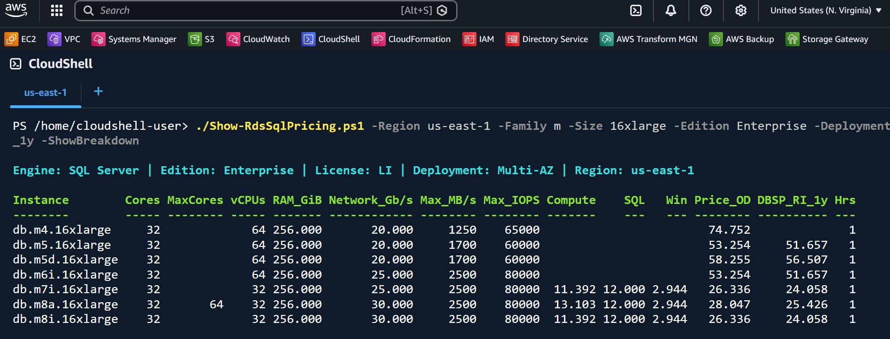

# Compare RDS for SQL Server Instance Pricing

## Use Case

When sizing or right-sizing Amazon RDS for SQL Server, choosing the right instance family and size requires understanding the **true total cost** — not just the base compute price. Newer-generation instances (db.m7i, db.m8i, db.m8a, etc.) use **unbundled pricing**, where SQL Server and Windows license fees are separate line items added on top of compute. Older generations (m5, r5, r6i) bundle compute, Windows, and SQL into a single price.

This makes apples-to-apples comparison difficult:

- **"Which is cheaper — an r6i.8xlarge or an r8i.8xlarge?"** The Pricing API shows a lower number for db.r8i, but SQL Server and Windows license fees need to be added.
- **"How much would I save with BYOM (Bring Your Own Media)?"** You need to know which families support BYOM and what the license-fee delta is.
- **"What's the 1-year commitment discount?"** Unbundled instances use Database Savings Plans; bundled ones use Reserved Instances — different APIs and calculations.
- **"What physical core count do I actually get with Optimize CPU?"** The default core count (relevant for SQL Server licensing) isn't visible in the console pricing page.

`Show-RdsSqlPricing.ps1` answers all of these in a single table, pulling live data from the AWS Pricing, RDS, EC2, and Savings Plans APIs.

## Common Scenarios

| Scenario | Command |
|----------|---------|
| Compare all R-family 8xlarge instances (Standard edition) | `./Show-RdsSqlPricing.ps1 -Family r -Size 8xlarge` |
| Enterprise edition, Multi-AZ, with savings plan pricing | `./Show-RdsSqlPricing.ps1 -Edition Enterprise -Deployment Multi-AZ -Size 8xlarge -DBSP_RI_1y` |
| BYOM cost comparison for 4xlarge | `./Show-RdsSqlPricing.ps1 -Edition Enterprise -Family m8i,r8i -Size 4xlarge -License BYOM -ShowBreakdown` |
| Monthly cost estimate exported to CSV | `./Show-RdsSqlPricing.ps1 -Family r -Size all -Hours 730 -PassThru \| Export-Csv monthly.csv` |
| Find the cheapest instance under $15/hr | `./Show-RdsSqlPricing.ps1 -Size 8xlarge -PassThru \| Where-Object Price_OD -lt 15 \| Sort-Object Price_OD` |

## Sample Output



## Quick Start

1. Open [AWS CloudShell](https://console.aws.amazon.com/cloudshell/)
2. Upload `Show-RdsSqlPricing.ps1` (Actions → Upload file)
3. Start PowerShell: `pwsh`
4. Run:

```powershell
./Show-RdsSqlPricing.ps1 -Family r -Size 4xlarge -Edition Standard
```

## Prerequisites

AWS CloudShell is recommended — PowerShell and AWS modules are pre-installed.

Modules required: `AWS.Tools.Pricing`, `AWS.Tools.RDS`, `AWS.Tools.EC2`

Optional (for commitment pricing): `AWS.Tools.SavingsPlans`

## Key Features

- Accurate total cost for both **bundled** (older gen) and **unbundled** (newer gen) pricing models
- SQL Server license fees calculated with the **Microsoft 4-vCPU minimum**
- **BYOM support** — filters to eligible families and removes the SQL Server fee
- **Physical core counts** (default + max) from RDS Orderable Instance Options
- **Network bandwidth**, **max EBS throughput**, and **max IOPS** per instance
- **1-year commitment pricing** (Database Savings Plan or Reserved Instance)
- Multi-AZ aware — correct license doubling for Windows OS only (SQL Server passive failover rights)

## Script Reference

See the full [README](https://github.com/aws-samples/technical-notes-for-microsoft-workloads-on-aws/blob/main/docusaurus/docs/SQL%20Server/Guides/Show-RdsSqlPricing/README.md) for complete parameter documentation, output column descriptions, and pricing logic details.

Download [Show-RdsSqlPricing.ps1](https://github.com/aws-samples/technical-notes-for-microsoft-workloads-on-aws/blob/main/docusaurus/docs/SQL%20Server/Guides/Show-RdsSqlPricing/Show-RdsSqlPricing.ps1) here.

---

*Craig Cooley — July 2026*
